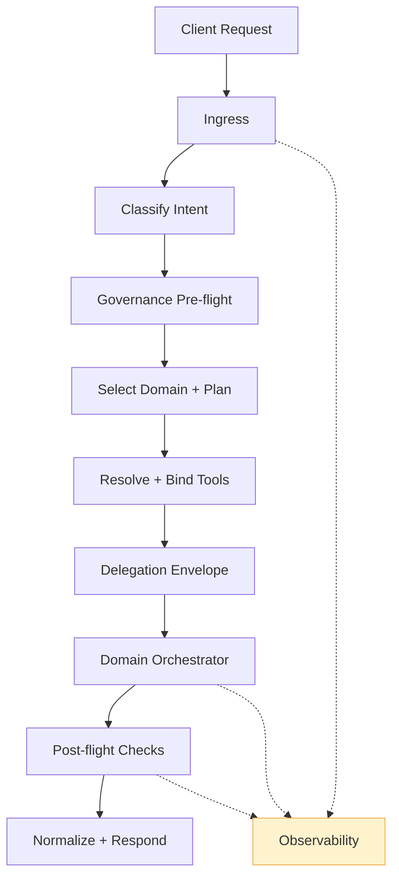

```mermaid
flowchart TD
    A[Client Request] --> B[Ingress]
    B --> C[Classify Intent]
    C --> D[Governance Pre-flight]
    D --> E[Select Domain + Plan]
    E --> F[Resolve + Bind Tools]
    F --> G[Delegation Envelope]
    G --> H[Domain Orchestrator]
    H --> I[Post-flight Checks]
    I --> J[Normalize + Respond]

    AA[Observability]:::obs
    B -.-> AA
    H -.-> AA
    I -.-> AA

    classDef obs fill:#fff3cd,stroke:#f0ad4e,stroke-width:1px,color:#333
```