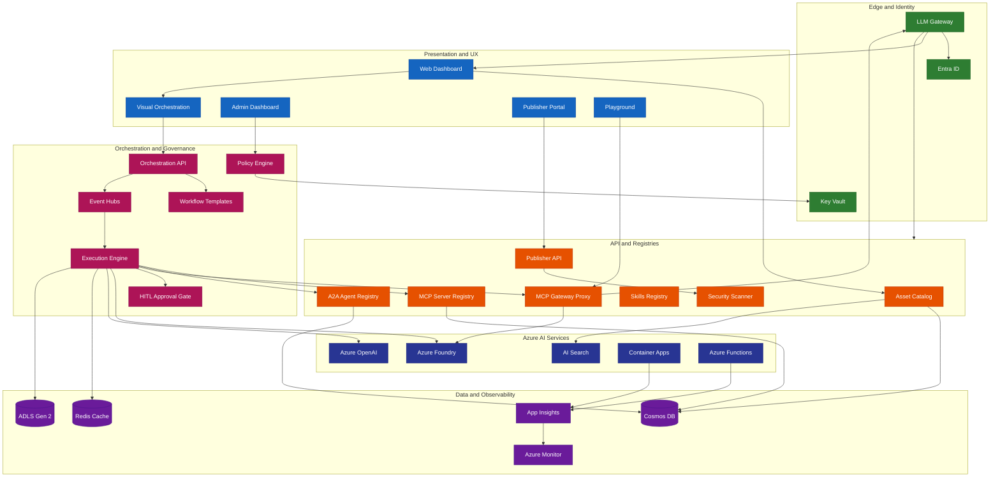

## Global Orchestrator Control Plane

The Global Orchestrator menu is a control-plane surface for routing status, policy decisions, and governed follow-through. It does not replace Policy Registry, onboarding, observability, or domain-internal execution tools.

- Operators use the Execution Cockpit to inspect tenant-scoped `GlobalExecutionRecord` projections by trace ID, current stage, selected domain, policy decision, safe domain summary, and link descriptors.
- Domain authors use My Routable Agents to see derived routability over onboarding, A2A registry, policy, evaluation, schema, and health gates. The UI does not write an independent registered flag.
- API routes derive tenant and role from authenticated context. Local development can use explicit dev headers only when the fallback is enabled; production paths fail closed without bearer-token validation.
- Cosmos stores projection records in `global-execution-records`, partitioned by `tenantId` with 90-day retention and indexes for tenant/time and tenant/stage/time reads.
- Dead-letter follow-through is represented as minimized descriptors on the projection unless a separate governed workflow exists. Raw envelopes and PHI-bearing payloads do not belong in the cockpit record.
- Application Insights telemetry for cockpit summaries must pass through the PHI scrubber before export.
