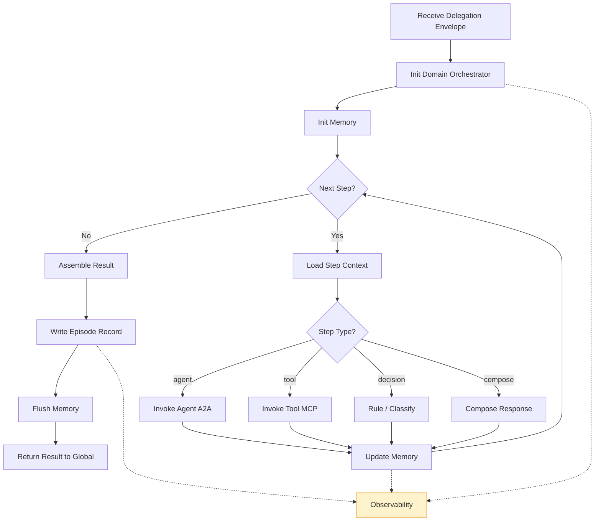

```mermaid
flowchart TD
    A[Receive Delegation Envelope] --> B[Init Domain Orchestrator]
    B --> C[Init Memory]
    C --> D{Next Step?}
    D -->|No| I[Assemble Result]
    D -->|Yes| E[Load Step Context]
    E --> F{Step Type?}
    F -->|agent| G1[Invoke Agent A2A]
    F -->|tool| G2[Invoke Tool MCP]
    F -->|decision| G3[Rule / Classify]
    F -->|compose| G4[Compose Response]
    G1 --> H[Update Memory]
    G2 --> H
    G3 --> H
    G4 --> H
    H --> D
    I --> J[Write Episode Record]
    J --> K[Flush Memory]
    K --> L[Return Result to Global]

    AA[Observability]:::obs
    B -.-> AA
    H -.-> AA
    J -.-> AA

    classDef obs fill:#fff3cd,stroke:#f0ad4e,stroke-width:1px,color:#333
```
