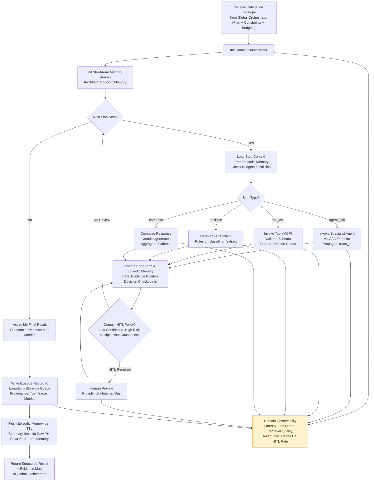

```mermaid
flowchart TD
    %% Ingress & init
    A["Receive Delegation Envelope<br/>from Global Orchestrator<br/>(Plan + Constraints + Budgets)"] --> B["Init Domain Orchestrator"]
    B --> C["Init Short-term Memory (Redis)<br/>Init/Attach Episodic Memory"]

    %% Main loop
    C --> D{"Next Plan Step?"}
    D -->|No| N["Assemble Final Result<br/>Outcome + Evidence Map<br/>Metrics"]
    D -->|Yes| E["Load Step Context<br/>From Episodic Memory<br/>Check Budgets &amp; Policies"]

    E --> F{"Step Type?"}

    %% Agent call
    F -->|agent_call| G["Invoke Specialist Agent<br/>via A2A Endpoint<br/>Propagate trace_id"]

    %% Tool call
    F -->|tool_call| H["Invoke Tool (MCP)<br/>Validate Schema<br/>Capture Reason Codes"]

    %% Decision step
    F -->|decision| I["Decision / Branching<br/>Rules or /classify or /extract"]

    %% Compose step
    F -->|compose| J["Compose Response<br/>/model /generate<br/>Aggregate Evidence"]

    %% Update memory
    G --> K["Update Short-term &amp; Episodic Memory<br/>State, Evidence Pointers,<br/>Decision Checkpoints"]
    H --> K
    I --> K
    J --> K

    %% Domain HITL
    K --> L{"Domain HITL Policy?<br/>Low Confidence, High Risk,<br/>Multiple Root Causes, etc."}

    L -->|No Review| D
    L -->|HITL Required| M["Human Review<br/>Provider UI / Internal Ops"]
    M --> K

    %% Episode completion
    N --> O["Write Episode Record to<br/>Long-term Store via Queue<br/>Provenance, Tool Traces, Metrics"]
    O --> P["Flush Episodic Memory per TTL<br/>Summary-first, No Raw PHI<br/>Clear Short-term Memory"]
    P --> Q["Return Structured Result<br/>+ Evidence Map<br/>To Global Orchestrator"]

    %% Observability
    classDef obs fill:#fff3cd,stroke:#f0ad4e,stroke-width:1px,color:#333;
    R["Domain Observability<br/>Latency, Tool Errors, Retrieval Quality,<br/>Token/Cost, Cache Hit, HITL Rate"]:::obs

    B --> R
    G --> R
    H --> R
    I --> R
    J --> R
    M --> R
    O --> R
```