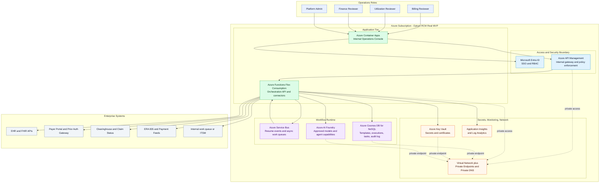

# Optum RCM Real MVP Architecture

This document narrows the ai-marketplace platform into the minimum production architecture for an internal Optum-style RCM deployment. The scope is limited to four production workflows:

1. Eligibility verification
2. Prior authorization
3. Claims submission
4. Payment posting and reconciliation

## One-Page Architecture Diagram

## Azure Service Mapping

| MVP capability | Azure service | Why it is in MVP | Notes |
|---|---|---|---|
| Internal operations console | Azure Container Apps | Hosts the reviewer and operations UI with simple container deployment and managed identity support | Use internal ingress or restrict public ingress to enterprise IP ranges |
| API gateway and policy choke point | Azure API Management | Central entry point for internal APIs, connector policies, throttling, JWT validation, and audit headers | Use internal mode for enterprise access where available |
| Orchestration runtime | Azure Functions Flex Consumption | Cost-efficient runtime for workflow APIs, resumable orchestration endpoints, and connector adapters | Keep workflow state in Cosmos DB, not in memory |
| Long-running wait states and async work | Azure Service Bus | Handles resume events, retries, dead-lettering, and decoupling from external systems | One namespace with workflow and connector queues is sufficient for MVP |
| Stateful workflow store | Azure Cosmos DB for NoSQL | Stores templates, executions, human tasks, audit log, and case snapshots | Prefer managed identity and RBAC over key-based access |
| AI execution | Azure AI Foundry | Provides approved enterprise model access for summarization, coding support, denial analysis, and structured outputs | Restrict to a small approved model allowlist per template |
| Secrets and certificates | Azure Key Vault | Holds connector secrets, certificates, and service credentials | Use RBAC, purge protection, and private endpoint |
| Monitoring and trace correlation | Application Insights plus Log Analytics | Captures workflow telemetry, failures, connector traces, and SLA dashboards | Use one workspace for MVP unless central enterprise monitoring requires a shared workspace |
| Network isolation | Virtual Network plus Private Endpoints | Protects Cosmos DB, Key Vault, Storage, and AI endpoints from broad internet exposure | Required for real enterprise healthcare deployment |
| Identity and RBAC | Microsoft Entra ID | SSO for reviewers and managed identity for workloads | Map reviewer roles to app roles or Entra groups |
| Container image registry | Azure Container Registry | Stores the operations console image and any custom connector images | Required only if the web tier is containerized |
| Function runtime storage | Azure Storage Account | Required backing store for the Function App and optional artifact staging | Lock down network and use private endpoint in production |

## Minimum Production Templates

| Template | Patterns used | Systems touched |
|---|---|---|
| Eligibility verification | Sequential, condition | EHR, payer eligibility service, audit |
| Prior authorization | Sequential, approval, pause/resume, condition | EHR, payer auth gateway, work queue, audit |
| Claims submission | Sequential, fan-out/fan-in, condition, approval | EHR, clearinghouse, payer rules, audit |
| Payment posting and reconciliation | Fan-out/fan-in, condition | ERA feed, fee schedule, finance queue, audit |

## Deployment Bill of Materials

| Resource type | Suggested quantity | Suggested SKU or tier | Purpose | MVP status |
|---|---|---|---|---|
| Resource group | 1 | N/A | Dedicated Optum RCM MVP resource group | Required |
| Virtual network | 1 | N/A | Shared security boundary for app, data, and private endpoints | Required |
| Subnets | 3 to 4 | N/A | App subnet, integration subnet, private endpoint subnet, optional APIM subnet | Required |
| Private DNS zones | 4 to 6 | N/A | Name resolution for Cosmos DB, Key Vault, Storage, AI Foundry, API Management private endpoints as needed | Required |
| Microsoft Entra app registration | 1 | N/A | UI sign-in and API audience | Required |
| User-assigned managed identities | 1 to 2 | N/A | Optional shared identity for container app and connectors if needed | Optional |
| Azure API Management | 1 | Standard v2 | Internal gateway, security policies, routing | Required |
| Azure Container Apps environment | 1 | Consumption or workload profile | Host environment for the operations console | Required |
| Azure Container App | 1 | 0.5 to 1 vCPU, 1 to 2 GiB to start | Internal web console | Required |
| Azure Container Registry | 1 | Basic | Stores the web image and any custom connector image | Required |
| Azure Functions plan | 1 | Flex Consumption | Hosts orchestration and connector APIs | Required |
| Azure Function App | 1 | Node.js 20 | Workflow API, callback handlers, connector facade | Required |
| Azure Storage Account | 1 | Standard LRS or ZRS | Function runtime storage and optional artifacts | Required |
| Azure Service Bus namespace | 1 | Standard | Async workflow events, retries, dead-letter queues | Required |
| Service Bus queues | 4 to 6 | Included | Resume events, connector jobs, approvals, dead-letter | Required |
| Azure Cosmos DB account | 1 | NoSQL autoscale | Workflow state, tasks, audit, snapshots | Required |
| Cosmos DB database | 1 | Included | Dedicated logical database for the MVP | Required |
| Cosmos DB containers | 5 | Included | templates, executions, tasks, audit-log, case-snapshots | Required |
| Azure Key Vault | 1 | Standard | Secrets, certificates, connector credentials | Required |
| Azure AI Foundry hub or project | 1 | Standard deployment footprint | Approved models and agent capabilities | Required |
| Azure AI model deployments | 2 to 4 | Based on selected models | Summarization, structured output, reasoning support | Required |
| Application Insights | 1 | Workspace-based | App telemetry and distributed tracing | Required |
| Log Analytics workspace | 1 | Pay-as-you-go | Central log sink for app and platform diagnostics | Required |
| Action groups and alerts | 1 set | N/A | Workflow failures, queue buildup, connector outages, latency | Required |
| Azure Monitor workbook | 1 | N/A | Operations dashboard for SLA and workload health | Optional |

## Initial Cosmos DB Containers

| Container | Partition key | Purpose |
|---|---|---|
| templates | /tenantId | Approved orchestration templates and versions |
| executions | /tenantId | Live workflow instances and current state |
| tasks | /assignedRole | Reviewer work queue items |
| audit-log | /executionId | Immutable execution event history |
| case-snapshots | /caseId | Normalized source payloads and retrieval snapshots |

## Recommended Identity and Access Model

1. Reviewers authenticate with Microsoft Entra ID.
2. The web console uses managed identity to call backend services where possible.
3. The Function App uses managed identity for Cosmos DB, Key Vault, Storage, and AI Foundry access.
4. Connector secrets remain in Key Vault.
5. Production templates are version-pinned and only editable by platform admins.

## Recommended MVP Resource Groups

| Resource group | Scope |
|---|---|
| rg-optum-rcm-real-prod | Application, integration, and data services for the MVP |
| rg-optum-rcm-real-monitoring | Optional separate monitoring group for shared Log Analytics and Application Insights if the enterprise wants lifecycle separation |

## What Is Deliberately Out of Scope

1. External publisher onboarding
2. Third-party asset submission workflow
3. General-purpose marketplace browsing
4. End-user template authoring in production
5. Multi-region active-active deployment in phase one

## Deployment Notes

1. Keep the first production release to one region, one tenant boundary, and four approved templates.
2. Use private networking, managed identity, and Key Vault from day one.
3. Prefer Cosmos DB RBAC instead of primary keys for production access.
4. Add Service Bus dead-letter monitoring before go-live.
5. Promote templates through dev, staging, and prod with pinned versions rather than editing in place.