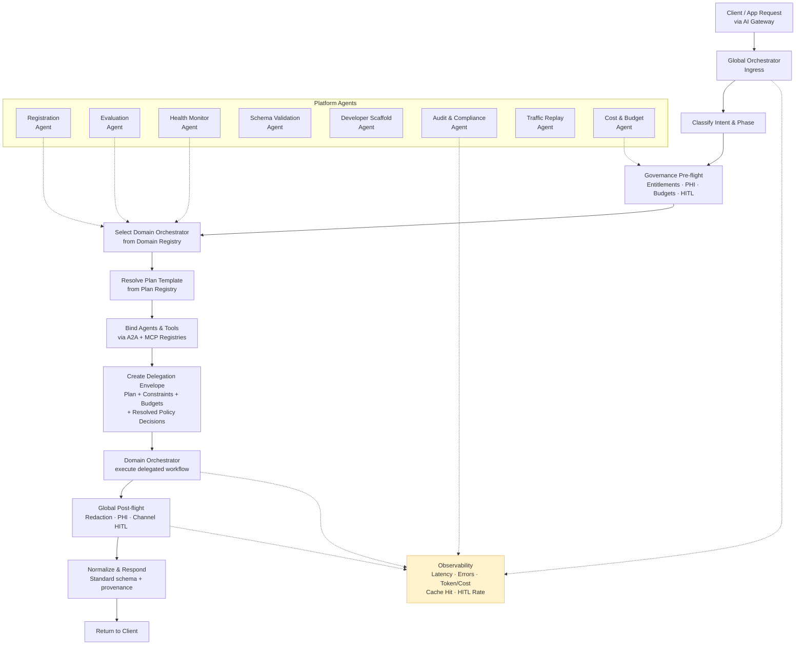

# Global Orchestrator — Two-Tier Orchestration Architecture

## Problem Frame

The AI Platform currently has a workflow execution engine built on a state machine that manages node lifecycles with edge-condition evaluation, loop back-edges, fan-out/fan-in, saga compensation, and per-node resume after human-gate approval. It runs template-defined node graphs with policy checks.

**Current state:** Today, when a user needs to run a multi-domain process (e.g., verify eligibility → submit claim → post payment), they must manually launch three separate workflow templates, manually sequence them, and governance checks apply per-template with no cross-workflow consistency. There is no automated handoff, no shared trace context, and no unified governance layer across invocations.

This works for single-domain workflows but cannot:

- **Route requests across domains** — A user request might touch eligibility, claims, and payment posting. There is no layer to classify intent and delegate to the right domain.
- **Enforce global governance** — Pre-flight checks (entitlements, PHI classification, budget enforcement) and post-flight checks (redaction, channel-level HITL) have no home above individual workflow nodes.
- **Compose domain orchestrators** — The platform architecture envisions specialist domain orchestrators (RCM, complaint management, etc.) that execute delegated plans. Today there is no delegation envelope, no domain registry, and no plan resolution layer.
- **Manage cross-domain memory and provenance** — Episodic memory, evidence maps, and trace correlation across a multi-step, multi-domain interaction have no coordinating layer.

The existing execution engine is the right foundation for domain-level orchestration. What is missing is the **Global Orchestrator** — the layer above that receives requests, classifies intent, applies global governance, selects a domain orchestrator, resolves a plan, and delegates execution via a structured envelope.

## Architecture Overview

## Requirements

**Intent Classification & Routing**

- R1. The Global Orchestrator receives inbound requests through a single ingress endpoint and classifies them by intent (domain, action, phase) using a configurable classification model.
- R2. Classification produces a structured intent object containing at minimum: domain identifier, action type, confidence score, and extracted entities.
- R3. When classification confidence is below a configurable threshold, the orchestrator handles it based on execution mode: for interactive (synchronous) requests, it may request clarification from the caller; for batch (asynchronous) requests, it routes to a fallback/triage queue for human review.
- R3a. The Global Orchestrator supports two execution modes: **interactive** (synchronous request/response with optional multi-turn) and **batch** (asynchronous fire-and-forget with result callback or polling). Requirements R26 (session context) and multi-turn behaviors apply only to interactive mode.
- R4. (Phase 2) When a multi-intent request is detected, the orchestrator flags it and routes to a triage/clarification flow rather than attempting automatic decomposition. Multi-intent decomposition with ordering dependencies is deferred to a later phase.

**Domain Registry & Selection**

- R5. A Domain Orchestrator Registry stores metadata for each registered domain orchestrator including: domain identifier, endpoint, supported intents, health status, version, and capacity constraints.
- R6. Domain selection uses the classified intent to resolve the target domain orchestrator. When multiple domains could handle an intent, selection follows a priority/specificity ranking from the registry.
- R7. Domain orchestrators register and deregister dynamically. The registry supports health checks and circuit-breaking for unavailable domains.

**Plan Resolution & Binding**

- R8. The existing `orchestration-templates` container is extended with domain routing metadata (domain identifier, supported intents, input field declarations) to serve as the Declarative Plan Template (DPT) store. Existing templates without domain metadata continue to function as single-domain workflow templates.
- R9. The Global Orchestrator selects the appropriate template/DPT based on the classified intent and the target domain. When multiple plans match, version pinning and priority rules govern selection.
- R10. After plan selection, the orchestrator resolves plan steps by binding agents from the A2A Agent Registry and tools from the MCP Server/Tool Registry. Binding produces concrete endpoint references and validates availability.
- R11. If a required agent or tool is unavailable or fails health checks at bind time, the orchestrator either selects an alternative binding (if configured) or fails the request with a clear error before delegation.

**Delegation Envelope**

- R12. The Global Orchestrator creates a Delegation Envelope — a structured message containing the resolved plan, bound agent/tool references, input data, governance constraints, budget limits, and trace context — and sends it to the selected Domain Orchestrator.
- R13. The Delegation Envelope schema is versioned and includes at minimum: `envelopeVersion`, `traceId`, `plan` (steps with bindings), `constraints` (policies, budgets, TTLs), `input` (sanitized request data), `callerContext` (tenant, user, channel), and `resolvedPolicyDecisions` (list of policy IDs and concern types already adjudicated at the global level, enabling the domain layer to skip re-evaluation of those concerns).
- R14. Sensitive fields in the input data are marked or redacted per governance pre-flight decisions before inclusion in the envelope. Plan templates declare their required input fields in metadata; the Global Orchestrator uses these declarations to filter input without requiring domain-specific knowledge.

**Governance Pre-flight**

- R15. Before delegation, the Global Orchestrator runs governance pre-flight checks that evaluate: caller entitlements (tenant, user, role), data sensitivity classification (PHI, PII, financial), budget availability (token budgets, cost ceilings), and global HITL rules.
- R16. Pre-flight governance integrates with the existing Policy Engine. Pre-flight decisions use the existing decision types: `allow`, `deny`, `pending-approval`, or `transform` (e.g., redact fields before delegation).
- R17. When pre-flight produces `deny`, the request is rejected with a reason before any domain orchestrator is invoked. When `pending-approval`, the request enters a global HITL queue before delegation proceeds.
- R17a. Global governance pre-empts domain governance. If global pre-flight denies or transforms, the domain orchestrator receives the post-governance version and applies its own per-node policy checks independently on that version. To avoid double-review, the Delegation Envelope includes a `resolvedPolicyDecisions` field listing policy IDs and concern types already adjudicated at the global level. The domain policy engine accepts this exclusion list and skips evaluation of those specific concerns.

**Governance Post-flight**

- R18. After the Domain Orchestrator returns a result, the Global Orchestrator runs post-flight checks: output redaction (PHI, PII), content safety, compliance validation, and channel-specific HITL rules.
- R19. Post-flight can transform the result (e.g., strip sensitive fields for external channels) or block the response entirely if policy violations are detected.
- R20. Both pre-flight and post-flight decisions are recorded in the audit trail with the execution's `traceId`.

**Domain Orchestrator Contract**

- R21. The existing workflow execution engine (a state machine with edge-condition evaluation, loop support, fan-out/fan-in, saga compensation, and human-gate resume) is promoted to serve as the Domain Orchestrator. It receives a Delegation Envelope, executes the plan steps using its existing node execution pipeline, and returns a structured result.
- R22. The Domain Orchestrator can access context from the current execution and, optionally, from prior executions within the same domain. The persistence mechanism for this context is deferred to planning.
- R23. The execution engine registers 22 handler types. The **core handlers** are: `agent`, `tool`, `condition`, `loop`, `fan-out`, `fan-in`, `approval`, `transform`, `start`/`trigger`, `end`/`output`. The **remapped types** from the canvas taxonomy are: `model` → AgentHandler, `knowledge` → ToolHandler, `evaluator` → AgentHandler, `guard` → AgentHandler, `human` → ApprovalHandler. Five **Phase 2 stub types** exist: `map-reduce`, `sub-workflow`, `supervisor`, `saga`, `consensus` (currently stubbed to AgentHandler). For plan template resolution at the global layer, these map to four logical step categories: `agent_call` (agent, evaluator, guard, model, supervisor, consensus), `tool_call` (tool, knowledge), `decision` (condition, transform), and `flow_control` (loop, fan-out, fan-in, map-reduce, sub-workflow, start, trigger, end, output). The human/approval type maps to HITL policy (R24). The saga type maps to the existing compensation state machine. Existing templates using any registered handler type continue to function without modification.
- R24. The Domain Orchestrator applies domain-specific HITL policies (low confidence, high risk, multiple root causes) independently of the Global Orchestrator's channel-level HITL.
- R25. On completion, the Domain Orchestrator returns a structured result containing: outcome, evidence map (pointers to sources and intermediate outputs), metrics (latency, token usage, tool errors), and an episode record for long-term storage.

**Failure & Retry Semantics**

- R34. The Global Orchestrator enforces a configurable delegation timeout per domain. If the Domain Orchestrator does not respond within the timeout, the delegation is marked as failed with a timeout reason.
- R35. When a Domain Orchestrator returns a partial result (some steps completed, some failed), the Global Orchestrator records the partial result and reports it to the caller with clear indication of which steps succeeded and which failed.
- R36. (Phase 2) Delegated plans are idempotent: re-delegating the same envelope (same traceId + plan) to a domain produces the same result or safely resumes from the last completed step. This requires dedicated design (idempotency key lookup, step-level resume, side-effect gating) and is not a property of the current engine. For Phase 1, R37 (dead-letter queue + manual retry) is the failure recovery mechanism.
- R37. Failed delegations are written to a dead-letter queue with the full envelope for manual inspection or automated retry. Retry policy (max attempts, backoff) is configurable per domain in the Domain Registry.

**Memory & Episode Management**

- R26. For multi-turn interactive requests, the Global Orchestrator accepts caller-provided session context (conversation history references, prior intents, accumulated constraints) as a signed context blob in each request. It validates the context but does not store it server-side. Batch requests do not use session context.
- R27. Domain Orchestrators write episode records (provenance, tool traces, metrics) to a durable store without blocking execution. Episode records do not contain raw PHI; they store summary references only.
- R28. Episodic memory has configurable TTL per domain. Short-term execution memory is flushed on completion; episode summaries persist per retention policy.

**Observability**

- R29. The Global Orchestrator emits structured telemetry at each major step (ingress, classification, pre-flight, delegation, post-flight, response) including latency, token/cost, error counts, cache hit rates, and HITL/remediation rates.
- R30. All telemetry is correlated by `traceId` across the global and domain layers, enabling end-to-end distributed tracing from client request through domain execution and back.
- R31. Observability data flows to Application Insights and supports custom dashboards and alerting on orchestration health, SLA compliance, and anomaly detection.

**Response Normalization**

- R32. The Global Orchestrator normalizes domain orchestrator results into a standard response schema before returning to the caller. The schema includes: `status`, `result`, `provenance` (trace references, evidence pointers), `warnings`, and `metadata` (latency, token usage).
- R33. Provenance in the response enables the caller to trace back through the execution chain: which domain handled the request, which plan was used, which agents/tools were invoked, and what governance decisions were applied.

**Tenant Isolation**

- R38. All new registries and stores (Domain Registry, Plan Registry, episode store, session context) maintain tenant isolation consistent with the existing `tenantId` partition key. Cross-tenant resource references are prohibited unless an asset is explicitly marked as shared.

**Platform Agents**

The Global Orchestrator ecosystem requires a set of platform-level agents that manage the lifecycle, quality, and developer experience of domain orchestrators and their constituent agents. These are not domain-specific — they are infrastructure agents that operate across all domains.

- R39. A **Domain Registration Agent** automates the onboarding of new domain orchestrators into the platform. It validates the domain's configuration (endpoint, supported intents, health check endpoint, capacity constraints), runs connectivity and schema compliance checks against the Domain Registry contract, registers the domain in the Domain Orchestrator Registry, and generates initial plan template scaffolds for the domain's declared intents. Domain developers interact with this agent to register, update, or deregister their domains without manual registry manipulation.
- R40. An **Evaluation Agent** assesses domain agents and domain orchestrators for production readiness before they are activated in the registry. It runs automated test suites against the domain's declared intents (synthetic requests, golden-set tests), measures response quality (accuracy, hallucination rate, format compliance), latency, token efficiency, policy compliance, and produces a structured evaluation report with a readiness score. Domains below a configurable readiness threshold are flagged as `evaluation-pending` in the registry and cannot receive production delegations until they pass.
- R41. A **Health Monitor Agent** continuously monitors registered domain orchestrators and the agents/tools they depend on. It performs periodic health probes, tracks error rates, latency trends, and availability. When a domain breaches health thresholds, the agent triggers circuit-breaking in the Domain Registry (R7), emits alerts via the observability layer (R31), and optionally routes affected in-flight requests to a fallback domain or triage queue.
- R42. A **Schema Validation Agent** validates plan templates, delegation envelopes, and domain configurations against their declared schemas before they are used in production. It catches structural errors, missing required fields, incompatible versions, and binding failures (agent/tool references that don't resolve) at design time rather than at delegation time. Domain developers invoke this agent during template authoring to get immediate feedback.
- R43. A **Developer Scaffold Agent** helps domain developers bootstrap new domains by generating starter configurations: domain orchestrator endpoint scaffolds, plan template skeletons for common workflow patterns (sequential, fan-out/fan-in, approval-gated, saga), sample policy definitions, and test harness configurations. It uses the existing template library and pattern handlers as reference material and adapts them to the developer's declared domain and intents.
- R44. An **Audit & Compliance Agent** aggregates execution audit trails across domains and generates compliance reports. It scans for policy violations, governance gaps, anomalous execution patterns, and surfaces them to platform administrators. For regulated domains (healthcare, finance), it produces domain-specific compliance artifacts (PHI access logs, approval chain records) aligned with regulatory requirements.
- R45. A **Traffic Replay & Simulation Agent** enables domain developers to test their domain orchestrators against historical traffic. It replays past delegation envelopes (with PHI/PII redacted) against a domain's staging endpoint, compares results to production outcomes, and produces regression reports. This supports safe iteration on domain logic without production risk.
- R46. A **Cost & Budget Agent** tracks token usage, model invocation costs, and resource consumption across domains and tenants. It provides cost attribution per domain, per template, and per execution. It enforces the budget limits declared in delegation envelopes (R15) and emits warnings when a domain approaches its budget ceiling. Platform administrators use it to understand cost distribution and set tenant-level budgets.
- R47. Platform agents register in the A2A Agent Registry like any other agent and are invocable via the same A2A protocol. They are tenant-scoped where applicable (R38) but can operate in a platform-admin scope for cross-tenant operations (audit, health monitoring). Their deployment and versioning follow the same governance workflow as marketplace agents.

## Success Criteria

- The requirements are specific enough that `/ce-plan` can produce an implementation plan without inventing product behavior, scope boundaries, or governance rules.
- The two-tier separation (global → domain) is clear: what runs at each layer, what data flows between them, and how governance applies at both levels.
- The existing execution engine can be promoted to the domain layer with an adapter; the adaptation includes envelope intake, structured result output, step-type mapping, and context management (not trivial additions, but not a full rewrite).
- The design supports adding new domains without modifying the Global Orchestrator core — domains register in the Domain Registry and bring their own plan templates.
- Global Orchestrator overhead (ingress through delegation handoff) targets sub-2-second p95 latency for interactive requests. Batch requests have no real-time latency constraint.
- The system handles at least 50 concurrent delegations per tenant without degradation.

## Scope Boundaries

- **Not in scope:** Visual design-time canvas changes. The orchestrator page UX stays as-is; this requirements doc covers the runtime architecture only.
- **Not in scope:** Specific domain implementations (RCM workflows, complaint management). Those are separate planning efforts that consume the global orchestrator contract.
- **Not in scope:** Agent or tool implementation details. The orchestrator binds to existing A2A and MCP registry entries.
- **Not in scope:** Multi-region deployment. The architecture should not preclude it, but active-active is a later concern.
- **Not in scope:** Model fine-tuning or prompt engineering for the classification model. The orchestrator consumes a classification endpoint; training is separate.
- **Not in scope:** Billing or metering. Budget enforcement is in scope (pre-flight checks); actual metering/billing integration is not.

## Key Decisions

- **Promote existing engine to domain layer:** The current state-machine workflow engine (with edge conditions, loops, fan-out/fan-in, saga compensation, and human-gate resume) becomes the Domain Orchestrator rather than building a separate system. This preserves existing template/execution/policy code and avoids parallel systems. The adaptation is non-trivial — it includes envelope intake, structured result output, step-type mapping (22 registered handler types → four logical categories), execution context management, evidence map generation, and policy exclusion list support — but it reuses the core execution pipeline rather than rebuilding it.
- **Domain-agnostic from the start:** The Global Orchestrator does not hardcode domain knowledge. Domains self-describe via the Domain Registry and Plan Registry. RCM is the first domain to register but the architecture treats all domains uniformly.
- **Delegation Envelope as the contract boundary:** The envelope is a versioned, self-contained message that fully describes what the domain orchestrator should do. This decouples the global and domain layers and enables independent evolution.
- **Governance at two levels:** Global governance (pre/post-flight) handles cross-cutting concerns (entitlements, PHI, channel policy). Domain governance (existing per-node policy checks) handles domain-specific concerns (clinical risk, financial thresholds). These are independent and composable.
- **Extend existing templates for DPTs:** Rather than creating a separate Plan Registry, the existing `orchestration-templates` Cosmos DB container gains domain routing metadata (domain identifier, supported intents, input field declarations). This avoids schema duplication and leverages existing template CRUD, versioning, and fork infrastructure. Planning determines the exact schema additions.
- **Caller-managed session context:** For multi-turn interactive requests, the caller manages conversation context and passes it per-request (e.g., as a signed context blob). The Global Orchestrator is stateless — no server-side session store. This simplifies scaling and avoids session affinity requirements. R26 is satisfied by accepting and validating caller-provided context rather than maintaining it.

## Dependencies / Assumptions

- The existing A2A Agent Registry and MCP Server/Tool Registry are operational and contain entries that can be resolved at bind time. The current Cosmos DB containers (`a2a-agents`, `mcp-servers`, `mcp-tools`) are assumed to be the source of truth.
- The existing Policy Engine and its per-node pre/post policy checks continue to function at the domain layer. The global governance pre/post-flight is a new layer that wraps the same Policy Engine interface at a different scope.
- Azure AI Foundry or Azure OpenAI provides the classification model endpoint. The orchestrator calls it as a tool — it does not host the model.
- Azure Service Bus or Event Hubs is available for async episode record writes. The current architecture docs reference Event Hubs; the RCM MVP references Service Bus. The choice is deferred to planning.

## Outstanding Questions

### Resolve Before Planning

(None — all product decisions are resolved.)

### Deferred to Planning

- [Affects R1, R2][Needs research] Which classification model approach is best for intent routing — a fine-tuned classifier, a structured-output LLM call (/classify), or a hybrid? What latency and accuracy tradeoffs exist?
- [Affects R5, R7][Technical] Should the Domain Orchestrator Registry be a new Cosmos DB container or an extension of the existing execution engine metadata? What schema provides efficient health-check polling?
- [Affects R8, R9][Technical] What schema fields need to be added to the existing `orchestration-templates` container for domain routing (domain identifier, supported intents, input field declarations)? How do these interact with existing template queries and the templates UI?
- [Affects R12, R13][Technical] What is the exact Delegation Envelope JSON schema? Planning should define the wire format, versioning strategy, and backward-compatibility rules.
- [Affects R21][Technical] What specific changes does the existing execution engine need to accept a Delegation Envelope as input instead of (or in addition to) the current `startExecution` payload?
- [Affects R22, R27, R28][Needs research] What is the right episodic memory store — Redis for short-term with Cosmos DB for episodes, or a unified approach? What TTL defaults make sense for healthcare vs. general domains?
- [Affects R26][Technical] What is the signed context blob format, validation strategy, and size limits for caller-managed session context?
- [Affects R17a][Technical] The domain policy engine needs to accept a `resolvedPolicyDecisions` exclusion list from the Delegation Envelope. What modifications to the existing `PolicyContext` interface are required?
- [Affects R36][Phase 2] Idempotent delegation requires dedicated design: idempotency key lookup, step-level resume detection, and side-effect gating in agent/tool handlers.
- [Affects R29, R30, R31][Technical] What OpenTelemetry instrumentation pattern should the orchestrator use? Should it extend the existing Application Insights integration or set up a separate OTLP exporter?
- [Affects R4][Phase 2] Multi-intent decomposition with ordering dependencies is deferred. When Phase 2 is planned, research strategies for handling ordering dependencies between sub-intents.
- [Affects R39-R47][Technical] What is the deployment topology for platform agents — co-located with the Global Orchestrator (Azure Functions in the same app), separate Container Apps, or deployed via the marketplace's own agent publishing pipeline?
- [Affects R40][Needs research] What evaluation metrics and golden-set testing frameworks are appropriate for assessing domain agent readiness? How should the readiness threshold be calibrated per domain?
- [Affects R41, R7][Technical] What circuit-breaking strategy should the Domain Registry use? Active health probes vs. passive failure-count-based? What failure threshold triggers circuit-open? What happens to in-flight delegations when a circuit opens?
- [Affects R45][Technical] How should historical delegation envelopes be stored and indexed for replay? What PHI/PII redaction is applied before replay, and how is result comparison scored?

## Next Steps

→ `/ce-plan` for structured implementation planning
