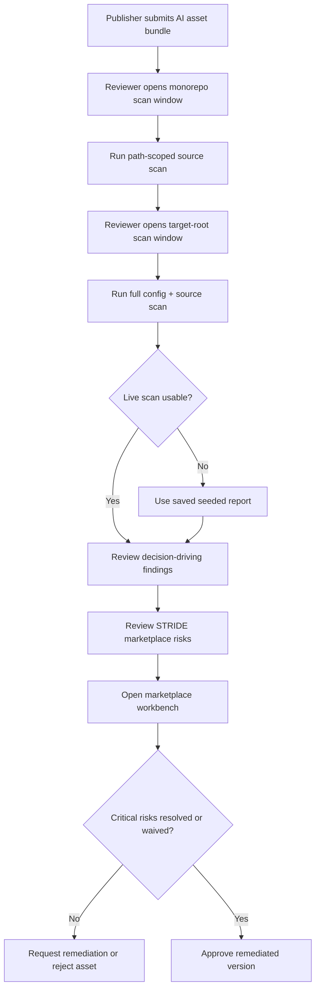

# ATV Security Marketplace Demo

## Problem Frame

The one-hour demo needs to show the full capability of `/atv-security` without feeling like a checklist of unrelated vulnerability examples. The strongest narrative is an AI Asset Marketplace security review: a publisher submits an agent bundle that includes application code, MCP tools, skills, hooks, and editor/agent configuration; platform security runs `/atv-security`; reviewers decide whether the asset can be approved for enterprise use.

This framing matches the product mission in `CLAUDE.md`, the existing demo target under `demos/atv-security-target`, and the visual workbench at `apps/web/app/atv-security/page.tsx`.

## User Flow

## Existing Fixture Inventory

| Required surface | Existing fixture |
| --- | --- |
| Submitted application code | `demos/atv-security-target/src/routes/*.js`, `demos/atv-security-target/src/services/*.js`, `demos/atv-security-target/src/mcp/tools.js` |
| Seeded marketplace cases and agents | `demos/atv-security-target/src/db.js` |
| Agent definitions | `demos/atv-security-target/.github/agents/unsafe-maintainer.agent.md` |
| Skill definitions | `demos/atv-security-target/.github/skills/unsafe-helper/SKILL.md` |
| MCP configuration | `demos/atv-security-target/.github/copilot-mcp-config.json` |
| Hook configuration and scripts | `demos/atv-security-target/.github/hooks/copilot-hooks.json`, `demos/atv-security-target/.github/hooks/scripts/post-tool-use.js` |
| VS Code / agent permissions | `demos/atv-security-target/.vscode/settings.json` |
| Productized triage surface | `apps/web/app/atv-security/page.tsx` |

## Requirements

**Demo Narrative**
- R1. The demo app must represent a submitted AI marketplace asset bundle rather than a generic vulnerable app.
- R2. The presenter must be able to explain the asset as containing application code, seeded agents, skill instructions, MCP tool configuration, hooks, and VS Code/agent permissions.
- R3. The story must support a clear reviewer decision: request remediation or reject the unsafe submitted asset, with approval reserved for a clearly labeled remediated version.
- R4. The submitted asset must have visible marketplace context: asset name, publisher, requested publication action, bundle inventory, requested permissions, and current review status.

**Golden Path Evidence**
- R5. The live walkthrough should focus on three to five decision-driving risks rather than every seeded issue: unpinned or overbroad MCP execution, prompt/hook exfiltration risk, broken authorization, SSRF/data exposure, and one STRIDE synthesis.
- R6. The demo must still make clear that `/atv-security` can scan representative OWASP, agentic config, and STRIDE surfaces, with broader category coverage available in the saved report or appendix.
- R7. Findings must be labeled as live scanner output, seeded fallback evidence, or workbench fixture data so viewers understand the assurance level.
- R8. Fix mode must be positioned as assisted remediation requiring human review and tests; it must not be presented as automatic approval.

**Scanner Choreography**
- R9. The demo must include a path-scoped scan of `demos/atv-security-target` from the monorepo to show source-focused review inside a larger workspace.
- R10. The demo must include a full scan from a second VS Code window rooted at `demos/atv-security-target` so demo-local `.github/` and `.vscode/` config fixtures are discoverable.
- R11. The presenter environment must keep the monorepo workbench and target-root scanner context available at the same time, preferably with two pre-opened VS Code windows.
- R12. The demo must include a preflight check that verifies the target-root window can see `.github/` and `.vscode/` before the live scan starts.

**Workbench and Governance**
- R13. The visual workbench at `apps/web/app/atv-security/page.tsx` must be shown as a local demo governance surface, not the scanner itself.
- R14. The workbench must use marketplace-specific copy/data: submitted asset bundle, publisher, publication gate, scan scope, finding evidence, remediation owner, and approval status.
- R15. The workbench must show the same decision path as the scan story: new, in review, needs remediation, waived by reviewer, rejected, and approved remediated version.
- R16. Approval actions in the workbench must be local/demo-only or seeded mock events; they must not imply production marketplace publication.

**Fallback and Safety**
- R17. The demo must include one canonical fallback artifact: a dated, sanitized sample `/atv-security` report for `demos/atv-security-target`, plus a short presenter note mapping key findings to the golden path.
- R18. All fake secrets, tokens, endpoints, patient/member/person data, and organization identifiers must be synthetic, clearly labeled as fake, and validated before the demo.
- R19. The scan target must remain inert during the demo: no hook execution, no MCP server startup, no dependency installation, no network egress, no real credentials, and no permission grants.
- R20. The intentionally vulnerable target must remain excluded from production build and deployment paths.

**One-Hour Structure**
- R21. The primary demo must be a 60-minute technical path with setup, live scan, fallback branch, findings walkthrough, STRIDE synthesis, workbench governance walkthrough, and Q&A.
- R22. A shorter 30-minute executive path may exist as a subset, but it must not replace the one-hour technical demo requested here.
- R23. The first half should prove scanning breadth; the second half should show how a small set of findings become governance decisions inside the marketplace workflow.

## Success Criteria

- A viewer understands that `/atv-security` scans both AI-agent configuration and application source code.
- A viewer sees why AI marketplace approval needs security review beyond ordinary app scanning.
- The demo can reliably cover config rules, representative OWASP coverage, STRIDE, report mode, fix-mode positioning, and approval workflow within one hour.
- A viewer can explain why this submitted asset should be rejected or sent back for remediation before marketplace publication.
- The presenter can recover gracefully if live scanner output is delayed by using pre-seeded evidence and the visual workbench.

## Scope Boundaries

- The demo app is intentionally vulnerable and must remain isolated under `demos/atv-security-target`.
- The demo should not attempt to make the vulnerable target production-safe during the main walkthrough.
- The workbench is a visual/product demo, not a replacement for the `/atv-security` Copilot Chat workflow.
- Real credentials, real patient/member data, and real production endpoints are out of scope.
- Live exploitation against real services, live dependency installation, and real MCP/tool execution are out of scope.
- Backend persistence, production approval enforcement, and scanner-to-workbench integration are out of scope unless added by a later plan.
- Detailed implementation changes belong in `/ce-plan`; this brainstorm defines the demo story and requirements.

## Key Decisions

- Use an AI Asset Marketplace plugin review story: This aligns directly with the project mission and makes agentic config scanning feel essential rather than incidental.
- Reuse the existing vulnerable target: `demos/atv-security-target` already contains source and config fixtures for the major `/atv-security` surfaces.
- Keep the visual workbench as the governance layer: `apps/web/app/atv-security/page.tsx` helps stakeholders see how scan findings become review, remediation, and approval decisions.
- Make request-remediation the expected demo decision: The submitted asset is intentionally unsafe, so approval should only appear as a remediated or waived mock state.
- Use a saved report as the fallback: This preserves credibility when live scanner latency or workspace state interrupts the flow.

## Dependencies / Assumptions

- `demos/atv-security-target` remains available as the isolated scan target.
- The demo-local `.github/` and `.vscode/` fixtures are discoverable when the demo target is opened as the workspace root.
- The presenter has Copilot Chat access to run `/atv-security` live.
- The marketplace web app can run locally if the visual workbench is shown live.
- The presenter can use two VS Code windows: one at the monorepo root and one at `demos/atv-security-target`.

## Alternatives Considered

| Option | Fit | Tradeoff |
| --- | --- | --- |
| AI healthcare/case intake portal | Strong fit for the existing case/intake code and high-stakes OWASP findings | Agentic config and MCP review feel less central to the story |
| AI asset marketplace plugin review | Best fit for full `/atv-security` capability and the project mission | Requires the presenter to frame the vulnerable target as a submitted asset bundle |
| Developer productivity agent workspace | Strong for prompt injection, hooks, and auto-approval | Weaker connection to the AI Marketplace product |
| Financial services assistant | Good compliance framing | Less aligned with existing demo fixtures |

## Outstanding Questions

### Resolve Before Planning

- None.

### Deferred to Planning

- [Affects R17][Technical] Decide the exact saved report path and whether it lives under `docs/security/` or `docs/deliverables/`.
- [Affects R21][Technical] Decide the exact minute-by-minute 60-minute run-of-show.
- [Affects R18][Technical] Choose the concrete pre-demo secret/PII validation command.

## Next Steps

→ `/ce-plan` for structured implementation planning