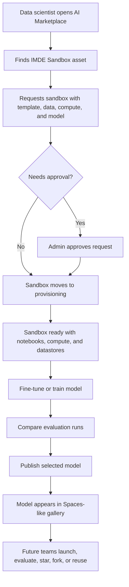

# IMDE Sandbox Spaces Executive Demo

## Problem Frame

The AI Marketplace already exposes an IMDE sandbox concept, but it is not yet developed into a convincing executive demo. Data scientists need a governed place to request a sandbox, open notebooks, use compute and approved datastores, fine-tune a model, evaluate the result, and publish it for reuse. Executives need to see the full innovation loop in one coherent product story: safe experimentation, reusable model assets, and a familiar modern sharing experience inspired by Hugging Face Spaces.

This demo should convince leaders that AI Marketplace is the governed operating model for turning data science experiments into reusable enterprise AI assets.

This brainstorm extends the existing sandbox direction in `docs/plan/sandbox-plan.md` and focuses it into a hybrid executive-demo slice: real product surfaces and backend capabilities where ready, with deterministic seeded data where live Azure operations would be slow or risky during the demo.

The canonical executive demo scenario is RCM denial prediction using synthetic or de-identified approved demo data. Other scenarios, such as ICD-10 autocoding, authorization scoring, and billing anomaly detection, may appear as gallery examples but should not compete with the primary story.

For this document, a **Published Model Experience** means a governed marketplace model asset with a Spaces-like discovery card and detail surface: runnable preview, evaluation summary, lineage, trust status, owner, and reuse actions.

## User Flow

## Demo Click Path

The executive demo should follow one primary path:

1. Marketplace catalog or IMDE landing page -> IMDE Sandbox asset.
2. Sandbox request stepper with seeded denial-prediction defaults.
3. Visible approval moment where the appropriate approver clears the request.
4. Sandbox workspace detail showing ready notebooks, compute, datastores, lifecycle, and launch actions.
5. Starter notebook and experiment run surfaces showing a prepared training/evaluation result.
6. Publish wizard that promotes the selected run through evaluation and governance.
7. Published Model Experience gallery card inside the existing Models marketplace.
8. Published Model Experience detail page with runnable preview, metrics, lineage, and reuse actions.

No external Azure ML Studio interaction is required to complete the visible executive demo path. Azure ML Studio and notebook links may be present as optional proof points.

The target presentation length is 15 minutes, with enough room to show the data scientist path, the approval handoff, evaluation comparison, publish flow, and reusable model experience without rushing through governance.

## Demo Fidelity Contract

| Step | Demo fidelity | Requirement |
|---|---|---|
| Sandbox request | Real persisted or seeded-persisted | Request should create or display a durable sandbox record. |
| Approval | Real persisted or seeded-persisted | Show a visible approver action and audit/lifecycle update. |
| Provisioning | Seeded deterministic | Demo must not wait on live AML provisioning, quota, or credentials. |
| Notebook activity | Marketplace-represented | Show starter notebook metadata and prepared output; external launch is optional. |
| Compute and datastore | Seeded deterministic | Show realistic status, data package binding, and governance labels. |
| Training/evaluation runs | Seeded deterministic | Show prepared metrics and artifacts for the denial-prediction scenario. |
| Publish submission | Real persisted or seeded-persisted | Preserve selected run, lineage, evaluation, and governance state. |
| Gallery/detail publish result | Seeded deterministic or projected from approved submission | The model must appear as a Published Model Experience during the demo. |
| Collaboration signals | Demo-visible lightweight actions | Star/save, duplicate, share, and notes can be local or seeded unless already implemented. |

Live AML provisioning must be disabled or bypassed during the executive demo unless it has been prevalidated immediately before the presentation.

## Spaces-Like UI Direction

The Models marketplace should feel visibly close to Hugging Face Spaces for this demo, especially in the gallery. Published Model Experience cards should read like runnable app tiles: preview area, model/app name, owner/team, task tags, live/ready status, short description, evaluation badge, stars/saves, forks/duplicates, and a primary launch action. Enterprise trust signals such as governance status, lineage, data classification, and approval state should be present, but they should support the card rather than make it feel like an admin table.

The detail page should continue the same pattern: runnable preview first, then overview/readme, metrics, lineage, versions, reuse actions, and governance evidence.

## Requirements

**Executive Demo Narrative**
- R1. The demo must tell one end-to-end story from marketplace discovery to sandbox request, notebook-driven training, evaluation, model publishing, and future reuse.
- R2. The demo must optimize for three executive takeaways: faster governed experimentation, a reusable model innovation loop, and an enterprise-ready Hugging Face Spaces-style experience.
- R3. The demo must use a healthcare/RCM example that shows data science value without requiring the audience to understand Azure ML internals.
- R3a. The MVP demo spine is discover sandbox, request governed workspace, show a visible approval moment, review prepared training/evaluation result, publish model, and see it reusable as a Published Model Experience.

**Sandbox Request and Workspace Experience**
- R4. A data scientist must be able to discover a sandbox capability from the marketplace and understand what the sandbox includes: notebooks, compute, approved datastores, model choices, governance, expiration, and publish path.
- R5. A data scientist must be able to request a sandbox by choosing a workspace template, approved data package, compute profile, duration, business justification, and optional base model for fine-tuning.
- R6. The sandbox detail experience must show lifecycle status, owner/team, expiration, approved data packages, compute profile, notebook launch actions, datastore availability, and recent lifecycle events.
- R7. The sandbox workspace must make the next action obvious: open or preview a starter notebook, view compute status and approved actions, inspect curated data packages, review seeded experiment runs, and publish a selected model.

**Notebook, Compute, Datastore, and Model Workflow**
- R8. The notebook experience must make denial-prediction fine-tuning the primary starter notebook path; other reusable starter notebooks such as LoRA fine-tuning, classification, clinical NLP, benchmarking, and explainability may appear as secondary template cards.
- R9. The compute experience must show whether compute is ready, starting, stopped, or approval-gated, with executive-readable labels for CPU, GPU, memory, and cost/risk posture.
- R10. The datastore experience must expose approved data packages as curated, governed assets rather than raw storage locations.
- R11. The model workflow must let the data scientist select or show a base model, run or review fine-tuning/training activity, and preserve lineage from sandbox, notebook, data package, and training run.
- R11a. All demo datasets, notebooks, evaluation artifacts, and lineage examples must be clearly labeled synthetic, de-identified, simulated, or approved demo data; no demo path may display or log real PHI.

**Evaluation and Publish Loop**
- R12. The experiment view must compare runs with metrics that executives can scan quickly, including quality, latency, status, selected winner, and governance readiness.
- R13. Publishing a model must feel like a guided promotion flow: select run, add model information, review evaluation results, pass governance checks, and publish to the marketplace.
- R14. Published models must retain lineage back to sandbox context, data packages, training run, evaluation artifacts, owner, and approval state.
- R15. The publish flow must support a deterministic successful path for the demo, including clear handling of under-review or approval-gated states.
- R15a. The MVP lineage payload must include sandbox, data package, notebook/template, base model, training run, selected metrics, owner, approval state, and publish timestamp.

**Spaces-Like Discovery and Reuse**
- R16. Published sandbox outputs must appear in a Spaces-like gallery with cards for runnable model experiences, owner/team, tags, task type, status, last updated time, stars, forks, evaluations, and launch action.
- R17. Each published model experience must have a detail page that combines a runnable demo area, overview/readme content, evaluation summary, version history, lineage, governance status, and reuse actions.
- R18. The Spaces-like experience must include lightweight collaboration signals for the demo: save/star, duplicate into a future sandbox, share, team notes, and team visibility. These may be demo-visible or locally persisted unless the capability already exists.
- R19. The Spaces-like experience should feel visually close to Hugging Face Spaces, with runnable preview cards as the most prominent gallery element, while still feeling like the AI Marketplace enterprise product.
- R19a. For MVP, Spaces-like reuse must prioritize enterprise trust signals over social mechanics: runnable preview, evaluation summary, lineage, approved reuse path, owner/team, and governance status.

**Governance, Trust, and Demo Fidelity**
- R20. The demo must clearly show that sandbox work is governed: approved data only, approval for sensitive data or GPU use, time-bound access, audit events, and publish gates.
- R21. The demo must be hybrid: use real APIs and persisted records where practical, and use seeded deterministic data where cloud provisioning, fine-tuning, or evaluation would be slow, brittle, or too expensive for a live executive demo.
- R22. Any seeded or simulated states must look operationally plausible and must not imply that sensitive production data is being used live.
- R23. The demo must include enough operational visibility for executives to trust the platform: lifecycle timeline, evaluation artifacts, lineage, and clear status transitions.
- R24. Approval gates must identify the accountable role: data steward for sensitive data, platform admin for GPU/quota, model governance approver for publish, and project owner for team visibility or reuse.
- R25. Azure ML workspace launch must preserve least-privilege, time-bound access expectations: approved users only, curated data packages only, no raw storage browsing in the demo path, and audit events for launch/access grants.

## Success Criteria

- An executive can watch the demo and explain the loop in one sentence: a data scientist requests a governed sandbox, trains and evaluates a model, then publishes a reusable model experience back to the marketplace.
- A data scientist persona can complete the visible flow without leaving the marketplace except for optional Azure ML Studio/notebook launch links.
- The demo has no fragile dependency on long-running live Azure provisioning or model training during the presentation.
- The Spaces-like gallery makes published sandbox outputs feel discoverable, reusable, and credible for future teams.
- Governance is visible as an enabler of safe speed, not as a disconnected admin feature.
- The presenter can reset the demo to the starting state and repeat the full flow with deterministic records and metrics.

## Scope Boundaries

- This is not a full custom notebook IDE; notebooks can launch into Azure ML Studio or be represented through marketplace starter notebook surfaces.
- This does not require real-time model fine-tuning during the executive demo; training and evaluation can use seeded runs if the product makes the lineage and workflow clear.
- This does not require public sharing, open community features, or external Hugging Face integration.
- This does not replace the marketplace publisher governance flow; published sandbox outputs should enter or represent that governed promotion path.
- Restricted PHI sandbox behavior should be shown as governed/approval-gated, but the MVP demo should avoid live PHI handling.
- Collaboration features are not a full social platform in the MVP; they are lightweight enterprise reuse signals unless explicitly promoted in a later plan.

## Key Decisions

- Use the existing sandbox plan as baseline: The new work should sharpen and extend `docs/plan/sandbox-plan.md` rather than create a parallel product concept.
- Prioritize a hybrid executive demo: The most reliable demo uses real marketplace interactions where available and deterministic data for slow cloud operations.
- Combine full journey and Spaces-like discovery: The demo should show both the data scientist path and the reusable published-model destination.
- Treat Hugging Face Spaces as inspiration, not a clone: The product should feel modern and familiar while preserving enterprise governance and marketplace identity.
- Make Published Model Experiences part of the marketplace model story: The demo should enrich the existing Models marketplace with Spaces-like cards and detail surfaces rather than introduce a separate product destination.

## Dependencies / Assumptions

- Existing IMDE surfaces already include sandbox, notebooks, experiments, and push-to-marketplace concepts that can be evolved for this demo.
- Existing sandbox backend capabilities appear to include request, approval, lifecycle events, sandbox templates, data packages, AML provisioning hooks, and publish-model handoff. Planning must verify which paths are demo-ready, which should be seeded, and which should be bypassed for the executive demo.
- The executive demo can rely on seeded RCM scenarios such as denial prediction, ICD-10 autocoding, authorization scoring, and billing anomaly detection.

## Outstanding Questions

### Resolve During Initial Planning

- [Affects R21][Technical] Decide the exact live/seeded boundary for the current frontend pages and sandbox APIs before implementation sequencing.
- [Affects R16, R17][Technical] Decide how the existing Models marketplace routes and data should be adapted to show Published Model Experiences.

### Deferred to Planning

- [Affects R12, R14][Needs research] Which evaluation artifacts are already available from the current Azure AI Foundry/Azure ML integration and which should be seeded for the demo?
- [Affects R5, R11][Technical] How should base model selection map to existing model catalog data for the first demo slice?

## Next Steps

-> /ce-plan for structured implementation planning.