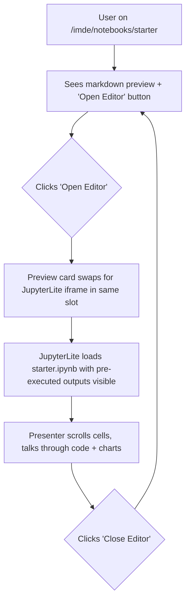

# JupyterLite "Open Editor" for the IMDE Starter Notebook

## Problem Frame

The IMDE executive demo lands on `/imde/notebooks/starter` (the RCM Denial
Prediction Starter notebook detail page). The page currently shows a static
markdown preview of the notebook content and an **Open Editor** button that
does nothing. On stage, this kills the IMDE pitch: the message is "build,
train, ship a model in the marketplace sandbox," but there is no editor to
demonstrate the "build" step.

We need clicking **Open Editor** to surface a Colab-like, interactive-looking
notebook UI inside the marketplace, sourcing real `.ipynb` content. The
durable capability behind this — shipping runnable starter notebooks per data
package — is worth more than the one demo step it unlocks.

## User Flow

## Requirements

**Editor Surface**
- R1. Clicking **Open Editor** on `/imde/notebooks/starter` replaces the
  existing **Notebook Preview** card (the `col-span-3` slot) with an embedded
  JupyterLite iframe. The right-side sidebar (Info, Tags) stays visible.
- R2. When the editor is open, the **Open Editor** button is replaced (or
  toggled) with a **Close Editor** control that restores the markdown preview.
- R3. The iframe occupies the full width of its grid slot and is at least
  `h-[80vh]` tall so cells, charts, and toolbars are readable on a projector.
- R4. The JupyterLite interface used is the **single-document Notebook**
  interface (`/jupyterlite/notebooks/index.html?path=...`), not the full Lab
  interface, to match the Colab look-and-feel the demo is aiming for.
- R5. The transition between preview and editor is fast (no full page
  reload). Subsequent toggles in the same session are instant.

**Notebook Content**
- R6. One real `.ipynb` is shipped for the demo:
  `starter.ipynb` for the RCM Denial Prediction starter (notebook id
  `starter`). It is authored to mirror the existing markdown preview content
  for that notebook (Objective, Data Overview, Quick Start, Next Steps).
- R7. The starter notebook is **pre-executed offline** before being committed
  — every code cell stores its rendered outputs (tables, charts) directly in
  the `.ipynb`. Opening it in JupyterLite shows outputs immediately, without
  the user needing to hit **Run All** on stage.
- R8. The other four mock notebooks on `/imde/notebooks` (advanced feature
  engineering, ICD-10 fine-tune, payer rules, model comparison, SHAP) remain
  preview-only for now. Their **Open Editor** button stays disabled or
  unwired in this iteration.

**Distribution and Hosting**
- R9. JupyterLite is **self-hosted as a static artifact** committed under
  `apps/web/public/jupyterlite/`. It is served by Next.js's static file
  handler at `/jupyterlite/*`. No CDN dependency at runtime.
- R10. The JupyterLite build is a **one-shot offline step**, not part of
  `npm run build`. A documented command (e.g.
  `python -m pip install jupyterlite-core jupyterlite-pyodide-kernel &&
  jupyter lite build --output-dir apps/web/public/jupyterlite`) regenerates
  the artifact. The built output is committed.
- R11. The starter `.ipynb` lives under
  `apps/web/public/jupyterlite/files/starter.ipynb` (the JupyterLite
  "contents" directory) so it shows up in the JupyterLite file browser and
  can be opened by path.

## Success Criteria

- On `/imde/notebooks/starter`, clicking **Open Editor** swaps in a working
  JupyterLite Notebook UI inside the existing page layout in under two
  seconds on a typical laptop.
- The opened notebook is `starter.ipynb` and renders code cells and their
  pre-executed outputs (at least one chart and one table) without the user
  needing to run anything.
- The demo presenter can walk through the cells, then click **Close Editor**
  and return to the markdown preview without a page reload.
- The marketplace branding/chrome (header, sidebar) remains visible while the
  editor is open — it is clearly "JupyterLite inside the marketplace," not a
  jump-out to a separate app.
- The JupyterLite artifact loads fully offline once cached (no third-party
  network calls during the demo).

## Scope Boundaries

- **Out of scope**: live model training on stage. Outputs are pre-baked.
- **Out of scope**: editing or saving the notebook back to any server.
  JupyterLite's default IndexedDB persistence is sufficient and is not
  surfaced as a feature.
- **Out of scope**: a remote Jupyter kernel, auth, or any backend
  integration. No new Azure Functions endpoints.
- **Out of scope**: wiring the other four mock notebooks to JupyterLite.
- **Out of scope**: data package CSVs being mounted into the JupyterLite
  file system. Any data the starter notebook references is either embedded
  inline as code or shown via pre-executed outputs.
- **Out of scope**: changing the `/imde/notebooks` list page UX.

## Key Decisions

- **Integration shape — self-hosted JupyterLite static artifact** under
  `apps/web/public/jupyterlite/`. Avoids dependency on
  `jupyter.org/try-jupyter`, keeps the demo fully offline-capable, and lets
  us pre-seed our own `.ipynb`.
- **Execution mode — pre-executed outputs only.** The notebook ships with
  outputs already saved. Pyodide doesn't have to succeed on stage, which
  removes the demo's biggest failure mode.
- **Editor placement — inline swap.** The editor replaces the preview card
  in-place rather than opening a new route, modal, or tab. Keeps marketplace
  chrome visible and is the smallest UX change consistent with a credible
  Colab-like demo.
- **JupyterLite interface — single-document Notebook (RetroLab-style).**
  Closer to Colab than full JupyterLab, simpler chrome, fewer panels.
- **Build is a manual one-shot, not part of `npm run build`.** Keeps the
  Next.js build fast and avoids a Python toolchain dependency in CI/Turbopack.
- **Only the `starter` notebook is wired in this iteration.** Authoring real
  `.ipynb` files for the other four mock notebooks is deferred until there's
  a demo or product reason.

## Dependencies / Assumptions

- Assumes the JupyterLite Pyodide kernel build (typical size 30–60 MB)
  is acceptable to commit to the repo. If not, it can be moved to a
  `.gitattributes` LFS path or fetched at deploy time; the requirement only
  says "self-hosted at `/jupyterlite/`," not "in git."
- Assumes `next.config.ts` does not need changes — `public/jupyterlite/`
  is served as a static asset path by default. To be confirmed in planning
  (some Next 16 / Turbopack edge cases around large static trees).
- Assumes the demo audience uses a modern browser (Chrome/Edge) that
  supports WebAssembly and SharedArrayBuffer headers JupyterLite needs.
  Cross-origin isolation headers may need to be set in Next config
  (`Cross-Origin-Opener-Policy`, `Cross-Origin-Embedder-Policy`) for the
  Pyodide kernel to initialize. Even though we don't run cells on stage,
  the kernel still tries to load — failing silently is fine, but worth
  validating in planning.

## Outstanding Questions

### Resolve Before Planning

_(none — all product decisions are settled)_

### Deferred to Planning

- [Affects R9][Needs research] Committing the ~30–60 MB JupyterLite build
  artifact directly to git vs `.gitattributes` LFS vs a post-clone bootstrap
  script. Planning should pick based on repo policy.
- [Affects R10][Needs research] Exact `jupyter lite build` invocation,
  Python version, and which JupyterLite plugins to include
  (`jupyterlite-pyodide-kernel` is required; whether to also include
  `jupyterlite-xeus` is open). Planning should script this and document it
  in the README.
- [Affects R3][Technical] Whether the iframe should use a fixed `h-[80vh]`
  or a dynamic resize-to-content scheme. Planning to validate on a
  1920×1080 projector and on a 13" laptop.
- [Affects R7][Technical] What library mix the starter `.ipynb` uses at
  authoring time (sklearn baseline only vs sklearn + xgboost + shap for a
  more impressive output set). Planning to confirm with the IMDE demo
  script owner.
- [Affects R5][Technical] Whether the JupyterLite iframe should be lazy-
  loaded on first **Open Editor** click or eagerly preloaded as soon as the
  page mounts. Tradeoff: faster toggle vs slower initial page load.
- [Affects R2][Needs research] Cross-origin isolation headers
  (`COOP`/`COEP`) for the JupyterLite route in Next 16 / Turbopack dev
  mode and in standalone production output.

## Next Steps

→ `/ce-plan` for structured implementation planning
