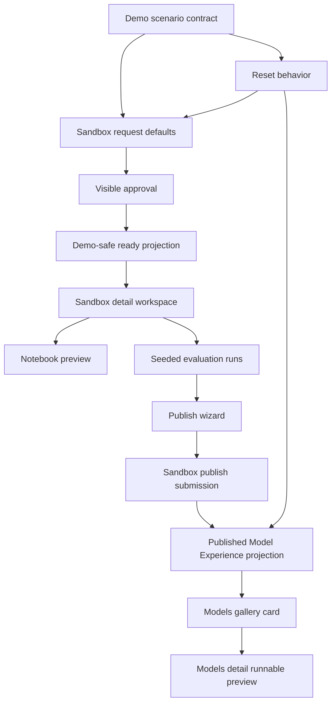

# feat: Build IMDE sandbox Spaces executive demo

## Overview

Build a 15-minute hybrid executive demo for IMDE sandbox modernization. The demo should show a data scientist requesting a governed RCM denial-prediction sandbox, receiving a visible approval, reviewing prepared notebooks/compute/datastores/evaluation runs, publishing the winning model, and seeing it appear in the existing Models marketplace as a Spaces-like Published Model Experience.

The work is an executive-demo slice, not a production hardening project. Request, approval, lifecycle, and publish records should use existing sandbox APIs where practical. Slow or brittle operations such as AML provisioning, model fine-tuning, live evaluation, and Published Model Experience projection should be deterministic and resettable for the demo unless explicitly prevalidated.

## Problem Frame

The current repo already contains sandbox APIs, IMDE pages, notebook/experiment/push mockups, and a Models marketplace, but these pieces are not yet connected into one convincing executive story. The plan turns those existing pieces into a coherent governed innovation loop while preserving the origin document's scope boundaries and safety posture (see origin: docs/brainstorms/2026-05-20-imde-sandbox-spaces-executive-demo-requirements.md).

## Requirements Trace

- R1-R3a: Create one end-to-end RCM denial-prediction story with a visible approval moment and executive-readable value.
- R4-R7: Make sandbox discovery, request, detail, lifecycle, compute, data packages, notebooks, and next actions clear.
- R8-R11a: Center the notebook/model path on denial-prediction fine-tuning with synthetic/de-identified demo data and preserved lineage.
- R12-R15a: Show prepared evaluation runs, selected winner, guided publish, deterministic success, and MVP lineage.
- R16-R19a: Extend the existing Models marketplace into a Spaces-like Published Model Experience gallery/detail flow.
- R20-R25: Keep governance visible, demo fidelity explicit, live AML bypassed, approval roles accountable, and sensitive-data expectations clear.
- Success criteria: The full visible demo path must be repeatable, marketplace-contained, and not dependent on live provisioning or training.

## Scope Boundaries

- Do not build a full notebook IDE; marketplace notebook previews and optional Azure ML Studio links are enough.
- Do not run real fine-tuning or live AML provisioning during the executive path.
- Do not create a separate public/community Spaces product; enrich the existing Models marketplace.
- Do not claim production-grade auth/RBAC. The demo should show governance state and role accountability while leaving production enforcement as follow-up.
- Do not expand collaboration into a social platform; save/star, duplicate, share, and notes are lightweight demo reuse signals.
- Do not use live PHI or production data. Demo data must be synthetic, de-identified, simulated, or approved demo data.

## MVP Cut

- **P0 for first executive demo cut:** sandbox discovery entry, request preset, visible approval, ready sandbox projection, seeded notebook/run review, publish selected run, Published Model Experience card/detail in Models, reset, and smoke walkthrough.
- **P1 after first browser walkthrough:** Spaces-like visual polish, detail-page refinement, improved filters/sort, stronger presenter script, screenshot evidence, and optional live Azure proof links.
- **P2/follow-up:** real collaboration persistence, generic reset framework, non-demo Published Model Experience status model, full frontend test harness, production auth/RBAC hardening, and live AML/Foundry execution.

## Context & Research

### Relevant Code and Patterns

- `apps/api/src/functions/sandbox/sandboxes.ts` already supports create/list/get/approve/reject/extend/suspend/resume/retire/events/publish-model, but approval currently triggers live AML provisioning.
- `apps/api/src/functions/sandbox/sandbox-templates.ts` and `apps/api/src/functions/sandbox/data-packages.ts` seed templates and packages, including `claims_training`, `denials_gold`, and restricted `clinical_notes_phi`.
- `apps/api/src/lib/aml/connector.ts` handles live AML workspace creation and data asset registration; the demo path should bypass this by default.
- `apps/web/src/lib/api/sandboxes.ts` already wraps sandbox API calls; extend this rather than inventing a second client.
- `apps/web/src/lib/types.ts` contains sandbox types; add demo lineage/base-model/publish fields here when frontend needs them.
- `apps/web/app/sandbox/request/page.tsx` and `apps/web/app/sandbox/[id]/page.tsx` are the main request/approval/detail flow surfaces.
- `apps/web/app/sandbox/page.tsx` should own or link the discovery entry into the demo path.
- `apps/web/app/imde/page.tsx`, `apps/web/app/imde/notebooks/page.tsx`, `apps/web/app/imde/experiments/page.tsx`, and `apps/web/app/imde/push/page.tsx` already contain the raw IMDE demo surfaces.
- `apps/web/app/models/page.tsx`, `apps/web/app/models/[id]/page.tsx`, and `apps/web/lib/models-data.ts` are the existing Models marketplace surfaces to extend.
- `apps/web/lib/foundry-client.ts` already treats live Foundry evaluation as optional and falls back to demo benchmark data.
- Backend tests use Node's built-in test runner against compiled `dist` files under `apps/api/test/*.test.js`.

### Institutional Learnings

- `docs/plans/2026-04-30-001-feat-atv-security-demo-alignment-plan.md` is the closest prior demo pattern: define the fixture contract, keep demo artifacts isolated from production paths, label provenance, and add repeatable verification.
- No formal `docs/solutions/` writeups were found for this repo.

### External References

- Hugging Face Spaces presents itself as an AI app directory with task filters, sort, owner identity, recency, and app-like cards. The plan uses those cues for the Models gallery while preserving enterprise trust signals.

## Key Technical Decisions

- Use the existing Models marketplace for Published Model Experiences: This matches the user's decision and avoids a parallel destination.
- Add an explicit demo mode/projection boundary before polishing UI: Approval-to-ready and publish-to-gallery are the highest-risk presentation seams.
- Use a canonical `imde-rcm-denial-demo` scenario contract: One fixture should feed request defaults, approval copy, notebook cards, runs, lineage, and model gallery state so the demo stays coherent.
- Make `demoScenarioId` and `baseModelId` first-class request/record fields: They are the durable discriminator for demo-safe provisioning, reset, and model lineage.
- Treat the backend scenario contract as authoritative: Frontend fixtures may mirror it for rendering speed, but implementation must add drift control or consume a backend scenario endpoint before relying on duplicated data.
- Keep backend records for request/approval/publish where practical: This makes the demo feel real and auditable while still bypassing slow AML work.
- Separate status vocabularies: `submission.status` should describe publisher workflow, `experience.status` should describe model marketplace visibility, and `experience.trustStatus` should describe governance/readiness.
- Treat Spaces-like collaboration as lightweight demo behavior: Runnable preview, trust, lineage, and evaluation are primary; social-style actions are secondary.

## Demo Contracts

### Action/Auth Posture

| Action | Demo actor | Server-side boundary |
|---|---|---|
| Create canonical sandbox | Data scientist persona | Requires allowed demo scenario, tenant, template, data package, compute profile, and demo-mode gate. |
| Approve canonical sandbox | Scenario-owned platform admin persona | Server sets approver identity for demo governance evidence; ignore caller-supplied approver overrides. |
| Reset canonical scenario | Presenter/admin only | Requires demo-mode gate and scenario/tenant allowlist; idempotent; unrelated records survive. |
| Publish selected run | Data scientist persona | Server derives lineage from scenario/sandbox/run records and validates selected run. |
| Share/duplicate/notes | Demo-visible user action | Local/seeded unless already implemented; no PHI, no direct sandbox/data access grant. |

Demo-mode activation should require more than a caller-supplied `demoScenarioId`: an explicit demo-mode setting, allowed tenant/environment, canonical template, allowed data packages, allowed compute profile, and canonical sandbox type. Reject partial matches.

### Projection Read Contract

| Contract | Decision |
|---|---|
| Publish response | Return `submissionId`, `projectionId`, `modelRouteId`, and the target `/models/[id]` route for the Published Model Experience. |
| Models list/detail source | Update `apps/web/app/api/models/route.ts` or an equivalent model data adapter so `/models` and `/models/[id]` can read published sandbox projections, not only static `models` data. |
| Cache behavior | The demo Published Model Experience must appear immediately after publish; avoid or bypass stale cache for the canonical scenario. |
| Reset behavior | Reset removes or hides the canonical projection and restores the pre-publish Models state. |

### Reset Contract

| Item | Requirement |
|---|---|
| Entry point | Scenario-scoped reset path for `imde-rcm-denial-demo`. |
| Scope | Tenant + scenario ID; never global. |
| Records touched | Demo sandboxes, sandbox lifecycle events, sandbox-sourced submissions, published experience projections, and local deterministic UI state. |
| Records preserved | Unrelated tenant records, unrelated scenario records, non-demo model catalog entries, and restricted data package seeds. |
| Idempotency | Reset can run before, during, or after a demo rehearsal and returns the same starting state. |

### Demo Smoke Path

The implementation should add one bounded smoke verification path, even if the repo does not yet have a full browser test harness: reset, open sandbox request, submit canonical request, approve, verify ready sandbox, open notebook/experiments, publish winning run, load returned model detail route, return to Models gallery, reset, and verify the published card/sandbox state returns to baseline.

## Open Questions

### Resolved During Planning

- Live/seeded boundary: request, approval, lifecycle, and publish records should be real or seeded-persisted; provisioning, notebooks, compute readiness, training/eval runs, and gallery projection should be deterministic by default.
- Published experience destination: enrich the existing Models marketplace rather than add a separate Spaces page.
- Canonical approval path: force a visible team/GPU approval moment for the primary 15-minute demo path.
- Reset architecture: use a narrow scenario-scoped reset for `imde-rcm-denial-demo`, with idempotency and tests proving unrelated tenant/scenario records are untouched.

### Deferred to Implementation

- Exact UI microcopy and final visual polish should be refined after the first browser walkthrough.
- If live Foundry/AML evaluation data is available in the environment, implementation may surface it as an optional proof point, but seeded evaluation remains the default demo source.
- Exact internal helper names and projection storage shape may depend on the implementation, but the externally visible contract must remain scenario-scoped and resettable.

## High-Level Technical Design

> *This illustrates the intended approach and is directional guidance for review, not implementation specification. The implementing agent should treat it as context, not code to reproduce.*

## Implementation Units

- [x] **Unit 1: Define Canonical Demo Scenario Contract**

**Goal:** Establish one shared denial-prediction demo scenario that drives request defaults, approval copy, notebook templates, compute/data labels, seeded runs, lineage, and the Published Model Experience.

**Requirements:** R1-R3a, R8-R11a, R12-R15a, R21-R23

**Dependencies:** None

**Files:**
- Create: `apps/web/lib/imde-demo-data.ts`
- Create or modify: `apps/api/src/lib/sandbox/demo-scenario.ts`
- Modify: `apps/api/src/functions/sandbox/data-packages.ts`
- Modify: `apps/web/src/lib/types.ts`
- Test: `apps/api/test/sandbox-demo.test.js`

**Approach:**
- Define `imde-rcm-denial-demo` as the canonical scenario ID across frontend and backend surfaces.
- Include seeded actors, approval roles, sandbox request defaults, `demoScenarioId`, `baseModelId`, synthetic/de-identified data package labels, base model reference, notebook metadata, evaluation runs, selected winner, lineage payload, and Published Model Experience summary.
- Keep the frontend fixture focused on UI rendering and the backend fixture focused on lifecycle/publish behavior; do not create a new shared package unless duplication becomes materially risky.
- Add drift control between frontend and backend scenario data: either frontend consumes a backend scenario response or a parity test/check validates scenario ID, package IDs, selected run ID, base model ID, and selected-winner metadata across both fixtures.
- Update seeded data package copy to avoid production/PHI implication in the primary path. Keep restricted/PHI examples as approval-gated proof only.
- Add fixture validation that fails if the primary scenario selects restricted/PHI packages, omits synthetic/de-identified labels, or includes PHI-looking preview content outside an explicitly excluded/approval-gated proof state.

**Patterns to follow:**
- Seed data style in `apps/api/src/functions/sandbox/sandbox-templates.ts` and `apps/api/src/functions/sandbox/data-packages.ts`.
- Static marketplace data style in `apps/web/lib/models-data.ts`.

**Test scenarios:**
- Happy path: scenario contract exposes `claims_training` and `denials_gold` as approved demo data with synthetic/de-identified labels.
- Happy path: selected evaluation winner contains sandbox, data package, notebook/template, base model, metrics, owner, approval state, and publish timestamp placeholders.
- Edge case: restricted `clinical_notes_phi` remains excluded from the primary scenario and is labeled approval-gated.
- Error path: fixture validation rejects primary-path copy or artifacts that imply live PHI, raw clinical notes, or production data.
- Error path: duplicate or missing scenario IDs fail the fixture validation test.

**Verification:**
- A single scenario ID can be traced through request defaults, sandbox detail, experiments, publish, and model gallery data.
- Primary demo copy does not imply live PHI or production data use.

- [x] **Unit 2: Add Demo-Safe Sandbox Approval and Reset Boundary**

**Goal:** Preserve real request/approval/lifecycle records while preventing the executive demo from waiting on live AML provisioning.

**Requirements:** R3a, R6, R20-R25, success criteria for repeatability

**Dependencies:** Unit 1

**Files:**
- Modify: `apps/api/src/functions/sandbox/sandboxes.ts`
- Modify: `apps/api/src/lib/cosmos/client.ts` if a new projection/reset container is needed
- Modify: `apps/web/src/lib/api/sandboxes.ts`
- Modify: `apps/web/src/lib/types.ts`
- Test: `apps/api/test/sandbox-demo.test.js`

**Approach:**
- Introduce an explicit demo-safe path that activates only for the canonical server-recognized `imde-rcm-denial-demo` scenario. Approval writes deterministic `provisioning` and `ready` state, launch URLs, data asset labels, and lifecycle events without invoking `apps/api/src/lib/aml/connector.ts`.
- Keep live AML provisioning available outside the demo path.
- Add reset support for presenter repeatability, scoped by tenant and `demoScenarioId`, so demo sandboxes, lifecycle events, publish submissions/projections, and local deterministic states can return to the starting point. Reset must be idempotent and must not affect unrelated records.
- Make approval actor and reason visible: platform admin approves team/GPU sandbox; model governance passes later in publish.
- Do not trust caller-supplied approver identity, tenant scope, ready-state fields, or lineage fields for demo projection. Server-owned fixture data should control the deterministic path.

**Patterns to follow:**
- Existing lifecycle event helper and status transitions in `apps/api/src/functions/sandbox/sandboxes.ts`.
- In-memory Cosmos behavior tested in `apps/api/test/cosmos-client.test.js`.

**Test scenarios:**
- Happy path: creating the canonical demo sandbox produces a requested record requiring approval.
- Happy path: approving the canonical demo sandbox emits approval/provisioning/ready lifecycle events and does not call live AML provisioning.
- Edge case: approving an already-approved or ready demo sandbox returns a conflict or disabled-equivalent state.
- Error path: arbitrary `demoScenarioId`, tenant, approver, or ready-state spoofing does not activate deterministic provisioning outside the canonical scenario.
- Error path: non-demo sandbox approval still follows existing live provisioning behavior unless explicitly configured otherwise.
- Integration: reset removes or restores demo-scoped sandbox and lifecycle state without affecting unrelated sandbox records.
- Integration: reset run against seeded unrelated tenant/scenario records proves those records survive.

**Verification:**
- The visible approval moment reliably transitions to a ready sandbox in seconds.
- Live AML provisioning cannot accidentally block the canonical demo path.

- [x] **Unit 3: Turn Sandbox Request and Detail into the Executive Spine**

**Goal:** Make `/sandbox/request` and `/sandbox/[id]` carry the first half of the 15-minute demo: seeded defaults, visible approval, ready workspace, notebooks/compute/datastores, lifecycle, and next actions.

**Requirements:** R4-R7, R9-R11a, R20, R24-R25

**Dependencies:** Units 1-2

**Files:**
- Modify: `apps/web/app/sandbox/page.tsx`
- Modify: `apps/web/app/sandbox/request/page.tsx`
- Modify: `apps/web/app/sandbox/[id]/page.tsx`
- Modify: `apps/web/src/lib/api/sandboxes.ts`
- Modify: `apps/web/src/lib/types.ts`
- Test: no dedicated web test harness exists; cover demo data through `apps/api/test/sandbox-demo.test.js` and verify UI by type-check/build plus browser walkthrough.

**Approach:**
- Add a one-click demo preset or default values for the denial-prediction request: team template, GPU or approval-gated compute, `claims_training`, `denials_gold`, base model, duration, justification, and cost center.
- Ensure the demo has a visible discovery entry from the sandbox landing page or marketplace/IMDE entry surface into the request preset.
- Present the request as a stepper or grouped form that makes template, data, compute, approval, and business justification easy to scan.
- On sandbox detail, add a lifecycle/timeline treatment that clearly shows request submitted, platform admin approval, deterministic provisioning, data package binding, and ready state.
- Replace external-only launch actions with marketplace-contained next actions: preview starter notebook, view prepared evaluation runs, publish selected run. Keep AML Studio links as optional proof points.
- Label data packages and seeded artifacts as synthetic/de-identified/approved demo data.
- Hide or disable AML Studio links unless the sandbox is ready and the link is clearly marked as external/live. If a live workspace is not prevalidated, use marketplace-contained preview actions only.
- Add light PHI-safety validation/redaction guidance for free-text demo fields such as justification, approval notes, model metadata, team notes, and share text; these fields should not appear in logs or UI evidence with PHI-like content.

**Patterns to follow:**
- Current form structure in `apps/web/app/sandbox/request/page.tsx`.
- Existing action sidebar and lifecycle event list in `apps/web/app/sandbox/[id]/page.tsx`.
- shadcn UI and lucide icon usage already present in the app.

**Test scenarios:**
- Happy path: sandbox landing/discovery entry routes to the request preset and makes the demo value proposition visible.
- Happy path: default demo request has all required fields and routes to the sandbox detail page after submit.
- Happy path: requested state shows the approval action with platform-admin role/reason copy.
- Happy path: ready state shows notebook, experiment, publish, compute, datastore, and lifecycle sections.
- Edge case: approval clicked twice disables or rejects the second action clearly.
- Error path: failed create/approve calls show actionable inline error without losing entered request data.
- Error path: PHI-like free text in demo inputs is blocked, redacted, or clearly excluded from persisted/logged demo evidence.

**Verification:**
- A presenter can get from sandbox discovery to ready workspace without explaining missing seams verbally.
- The happy path does not require leaving the marketplace.

- [x] **Unit 4: Connect Notebook and Experiment Surfaces to the Sandbox Story**

**Goal:** Make existing IMDE notebook and experiment pages feel sandbox-scoped and aligned to the denial-prediction scenario.

**Requirements:** R7-R12, R15a, success criteria for marketplace-contained flow

**Dependencies:** Units 1 and 3

**Files:**
- Modify: `apps/web/app/imde/notebooks/page.tsx`
- Modify: `apps/web/app/imde/experiments/page.tsx`
- Modify: `apps/web/app/imde/page.tsx` if it remains part of the demo entry path
- Modify: `apps/web/lib/imde-demo-data.ts`
- Test: no dedicated web test harness exists; verify scenario data through `apps/api/test/sandbox-demo.test.js` and UI by type-check/build plus browser walkthrough.

**Approach:**
- Make the denial-prediction notebook the primary card and demote other templates to secondary examples.
- Add sandbox context from route/query/local demo state so the notebook and experiment pages show the same sandbox name, data packages, base model, and owner/team as the detail page.
- In experiments, mark the winning completed run, show governance-ready status, and keep failed/running runs as context without enabling publish.
- Make metric labels executive-scannable: quality, F1/accuracy, latency, status, selected winner, and governance readiness.

**Patterns to follow:**
- Current static notebooks in `apps/web/app/imde/notebooks/page.tsx`.
- Current run table and metric cells in `apps/web/app/imde/experiments/page.tsx`.

**Test scenarios:**
- Happy path: notebook page opens with denial-prediction starter selected or visually dominant for the demo sandbox.
- Happy path: experiment page shows one selected winning run with publish enabled and lineage-ready metadata.
- Edge case: running/failed/non-winning runs cannot be published and explain why.
- Error path: missing sandbox context falls back to the canonical demo scenario rather than a blank page.

**Verification:**
- The presenter can move from ready sandbox detail to notebook preview to experiments without a narrative gap.

- [x] **Unit 5: Replace Thin Publish Path with Guided Lineage Publish Flow**

**Goal:** Make publishing the selected run feel like a governed promotion path and persist enough lineage for the model gallery payoff.

**Requirements:** R12-R15a, R20, R23-R24

**Dependencies:** Units 1, 2, and 4

**Files:**
- Modify: `apps/web/app/imde/push/page.tsx`
- Modify: `apps/web/app/sandbox/[id]/page.tsx`
- Modify: `apps/web/src/lib/api/sandboxes.ts`
- Modify: `apps/api/src/functions/sandbox/sandboxes.ts`
- Modify: `apps/web/src/lib/types.ts`
- Test: `apps/api/test/sandbox-demo.test.js`

**Approach:**
- Use the existing IMDE push wizard as the visual pattern, but bind it to the selected sandbox and winning seeded run.
- Expand publish payload planning around a lineage object: sandbox ID, template/notebook, base model, data package versions, selected run metrics, owner/team, approval state, and publish timestamp.
- Assemble the lineage snapshot server-side from sandbox/scenario/run records rather than trusting client-provided data wholesale. Client input may identify the selected run and model metadata, but owner/team, data packages, metrics, approval state, and evaluation artifacts should be derived or validated.
- Show governance steps as deterministic states: evaluation passed, model governance passed, published.
- Keep the existing submission creation, but add a named projection contract for the Models marketplace: projection ID/model route ID, source submission ID, lineage snapshot, `submission.status`, `experience.status`, `experience.trustStatus`, and reset behavior. Normalize the demo status vocabulary so the 15-minute path can show submitted, approved, and published without getting stranded in a pending state.
- For the canonical demo, create the submission and Published Model Experience projection in one deterministic flow. Label simulated governance approval as demo governance evidence rather than implying the production publisher review route ran.
- Critical demo copy such as approval reason, synthetic-data disclaimer, governance pass, publish success, and lineage labels must be fixture-backed or explicitly specified. Leave only cosmetic wording to post-walkthrough polish.

**Patterns to follow:**
- Wizard structure in `apps/web/app/imde/push/page.tsx`.
- Existing `publishSandboxModel` endpoint in `apps/api/src/functions/sandbox/sandboxes.ts`.

**Test scenarios:**
- Happy path: publishing the seeded winning run creates a sandbox-sourced submission with full MVP lineage.
- Happy path: publish response includes or enables a Published Model Experience projection for the Models marketplace.
- Happy path: projection ID resolves to the resulting `/models/[id]` detail route used by the success state.
- Edge case: publish from a non-ready sandbox returns a conflict.
- Edge case: publish without model name/version or selected run returns validation feedback.
- Error path: client attempts to override data packages, owner/team, approval state, metrics, or evaluation artifacts are rejected or ignored in favor of server-derived lineage.
- Integration: lifecycle event records the publish with submission/projection identifiers.
- Integration: immediately after publish, the returned model route can be loaded without waiting for stale model-list cache.

**Verification:**
- The publish wizard can deterministically land on a success state and link to the resulting Models marketplace detail.

- [x] **Unit 6: Add Spaces-Like Published Model Experience to Models**

**Goal:** Enrich the existing Models marketplace so the published sandbox result appears as a runnable, Spaces-like model experience with enterprise trust signals.

**Requirements:** R16-R19a, R14-R15a, R20-R23

**Dependencies:** Units 1 and 5

**Files:**
- Modify: `apps/web/lib/models-data.ts`
- Modify: `apps/web/app/api/models/route.ts`
- Modify: `apps/web/app/models/page.tsx`
- Modify: `apps/web/app/models/[id]/page.tsx`
- Create or modify: `apps/web/components/marketplace/*` or `apps/web/components/models/*` if component extraction keeps pages readable
- Test: no dedicated web test harness exists; verify scenario data through `apps/api/test/sandbox-demo.test.js` and UI by type-check/build plus browser walkthrough.

**Approach:**
- Extend the model data shape with optional Published Model Experience fields: experience type, preview metadata, trust status, lineage, evaluation summary, seeded/local saves/stars, seeded/local duplicates/forks, team notes preview, and reuse actions.
- Add the explicit read path from the projection contract so `/models` and `/models/[id]` can render the just-published canonical experience at runtime. If implementation chooses a static/demo adapter instead of backend retrieval, it must still satisfy the publish response route and reset behavior.
- Update `/models` cards to feel closer to Spaces: prominent runnable preview area, task tags/filters, owner/team, ready status, recency, evaluation badge, save/star, duplicate/fork count, and launch action.
- Update `/models/[id]` to conditionally render Published Model Experience layout with runnable preview first, followed by overview/readme, metrics, lineage, versions, reuse actions, and governance evidence.
- Preserve normal model cards/details for existing non-sandbox models.
- Keep collaboration actions bounded: share exposes marketplace-safe metadata only; duplicate/fork starts or simulates a new governed request rather than granting access to the original sandbox/data; team notes are treated as user content and must not carry PHI.

**UI information architecture:**
- Models gallery default view should sort the canonical Published Model Experience near the top after publish and expose task/category filters that do not hide it by default.
- Card priority order: runnable preview area, title/owner/team, ready/trust status, short description, task tags, evaluation badge, lineage/governance chips, save/duplicate signals, launch action.
- Detail priority order: runnable preview, evaluation summary, lineage, governance evidence, overview/readme, versions, reuse actions.

**Patterns to follow:**
- Current `ModelCard` and filter state in `apps/web/app/models/page.tsx`.
- Current detail tabs in `apps/web/app/models/[id]/page.tsx`.
- Hugging Face Spaces cues: app directory framing, task filters, sorting, owner identity, recency, and app-like cards.

**Test scenarios:**
- Happy path: the demo Published Model Experience appears in `/models` after publish/reset state says it should.
- Happy path: opening the model detail shows runnable preview, evaluation, lineage, governance, and reuse actions before generic API details.
- Edge case: non-experience models continue to render with the existing marketplace layout.
- Edge case: missing optional experience fields degrade gracefully without card layout breakage.
- Error path: duplicate/share/notes actions do not reveal sandbox-only data package details or PHI-like content.
- State coverage: loading, no-results filter, unpublished/reset state, preview unavailable, disabled collaboration action, and stale projection should have clear copy and safe CTAs.
- Accessibility: card and detail actions have readable labels and keyboard-focusable controls.

**Verification:**
- The Models marketplace visually communicates a Spaces-like app directory while retaining AI Marketplace trust and governance.

- [x] **Unit 7: Add Demo Verification and Presenter Runbook**

**Goal:** Make the 15-minute demo repeatable and reviewable before executive presentation.

**Requirements:** All success criteria, R21-R23

**Dependencies:** Units 1-6

**Files:**
- Create: `docs/deliverables/imde-sandbox-spaces-executive-demo-script.md`
- Create or modify: `docs/plan/sandbox-plan.md` only if it needs a short pointer to the focused executive-demo requirements
- Test: `apps/api/test/sandbox-demo.test.js`

**Approach:**
- Write a concise presenter script with timing targets for the 15-minute path: discovery, request, approval, ready sandbox, notebook, experiments, publish, Models gallery, model detail.
- Add a route-by-route demo table with URL/source, primary click, expected visible state, fallback if unavailable, timing, and talk-track proof point.
- Include reset instructions and expected starting/ending states without embedding fragile local machine assumptions.
- Include a demo-safe data statement: all visible data is synthetic, de-identified, simulated, or approved demo data.
- Add a browser walkthrough checklist covering desktop layout, projector/narrow-window sanity, keyboard navigation, focus after approval/publish success, screen-reader names for status badges, and key actions. Mobile is secondary unless the implementation touches responsive breakpoints substantially.

**Patterns to follow:**
- Demo-script structure in `docs/deliverables/onboarding-agent-executive-demo-script.md`.
- Fixture discipline from `docs/plans/2026-04-30-001-feat-atv-security-demo-alignment-plan.md`.

**Test scenarios:**
- Happy path: reset produces the documented starting state.
- Happy path: each runbook step has a corresponding UI state and expected outcome.
- Error path: if live Azure/Foundry integration is unavailable, the runbook still completes via deterministic demo data.
- Integration: smoke walkthrough records evidence that the returned model route loads after publish and disappears or returns to baseline after reset.

**Verification:**
- A presenter can rehearse the full path in 15 minutes and repeat it after reset.

## System-Wide Impact

- **Interaction graph:** Sandbox request/detail, IMDE notebook/experiment/push pages, sandbox API, Cosmos containers, and Models marketplace become one demo flow. Keep data contracts explicit to avoid hidden coupling.
- **Error propagation:** Sandbox create/approve/publish errors should surface inline in the UI and should not leave the presenter stranded without reset/fallback.
- **State lifecycle risks:** Demo records need a scenario ID and reset boundary to prevent stale published cards, duplicate sandboxes, or lifecycle events from previous rehearsals.
- **API surface parity:** Frontend sandbox API client and backend request/publish schemas must evolve together, especially for base model, demo scenario, lineage, and publish projection fields.
- **Integration coverage:** Unit tests should cover backend state transitions and lineage/projection contracts; browser walkthrough should cover cross-page flow.
- **Unchanged invariants:** Existing live AML connector remains available outside demo mode. Existing non-sandbox Models marketplace entries should keep their current behavior.

## Risks & Dependencies

| Risk | Mitigation |
|------|------------|
| Approval triggers live AML and stalls the demo | Add demo-safe provisioning boundary and test that canonical scenario bypasses live AML. |
| Publish creates a submission but no visible model card | Add Published Model Experience projection consumed by the existing Models marketplace. |
| Spaces-like scope grows into a second product | Keep the destination inside `/models`; treat collaboration as lightweight demo signals. |
| Demo copy implies live PHI or production data | Standardize synthetic/de-identified/approved demo labels across packages, notebooks, metrics, lineage, and runbook. |
| Static IMDE pages remain disconnected | Use the canonical scenario ID and sandbox/run context to link request, workspace, notebook, experiments, publish, and Models. |
| No frontend test harness exists | Cover data/state contracts in backend tests, require type-check/build, and add a browser walkthrough checklist for UI behavior. |

## Documentation / Operational Notes

- Add a presenter-facing runbook under `docs/deliverables/` before executive rehearsal.
- Keep the demo mode clearly scoped to the canonical scenario and do not present anonymous API routes as production governance enforcement.
- If a real Azure ML workspace is prevalidated for the presentation, use it only as an optional proof point; the visible path should still work without it.

## Sources & References

- **Origin document:** [docs/brainstorms/2026-05-20-imde-sandbox-spaces-executive-demo-requirements.md](../brainstorms/2026-05-20-imde-sandbox-spaces-executive-demo-requirements.md)
- Baseline plan: [docs/plan/sandbox-plan.md](../plan/sandbox-plan.md)
- Prior demo fixture pattern: [docs/plans/2026-04-30-001-feat-atv-security-demo-alignment-plan.md](2026-04-30-001-feat-atv-security-demo-alignment-plan.md)
- Sandbox API: `apps/api/src/functions/sandbox/sandboxes.ts`
- Sandbox frontend client: `apps/web/src/lib/api/sandboxes.ts`
- Sandbox pages: `apps/web/app/sandbox/request/page.tsx`, `apps/web/app/sandbox/[id]/page.tsx`
- IMDE pages: `apps/web/app/imde/page.tsx`, `apps/web/app/imde/notebooks/page.tsx`, `apps/web/app/imde/experiments/page.tsx`, `apps/web/app/imde/push/page.tsx`
- Models marketplace: `apps/web/app/models/page.tsx`, `apps/web/app/models/[id]/page.tsx`, `apps/web/lib/models-data.ts`
- External reference: https://huggingface.co/spaces