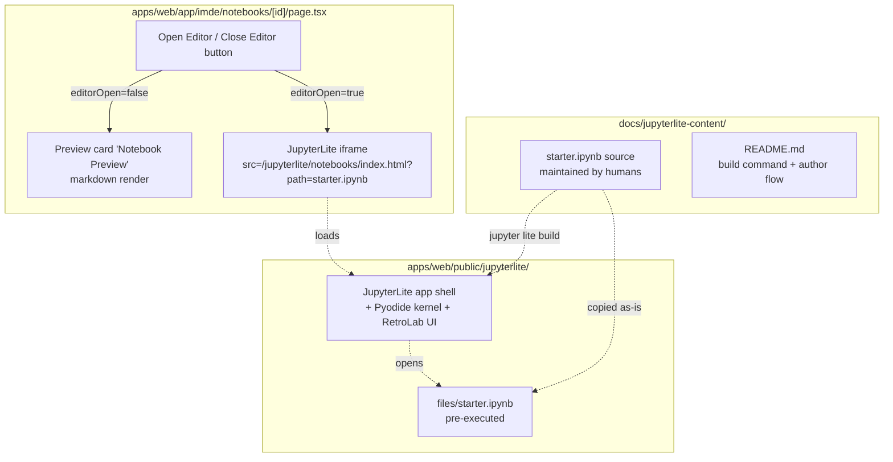

# feat: JupyterLite Open Editor for IMDE Starter Notebook

## Overview

Make the **Open Editor** button on `/imde/notebooks/starter` swap the existing
markdown preview card for an embedded JupyterLite (RetroLab-style) notebook
editor that renders a real `.ipynb` with pre-executed outputs. Self-hosted
under `apps/web/public/jupyterlite/`, no backend, no live execution required.

## Problem Frame

The IMDE executive walkthrough hits `/imde/notebooks/starter` to demonstrate
the "build a model in the sandbox" step. Today the **Open Editor** button is a
no-op and the page only shows a markdown blob, which breaks the pitch. The
work makes that button land on something that looks runnable, Colab-style,
inside our app shell — and gives the marketplace a durable surface for
shipping starter notebooks per data package (see origin:
[docs/brainstorms/2026-05-21-jupyterlite-starter-notebook-editor-requirements.md](docs/brainstorms/2026-05-21-jupyterlite-starter-notebook-editor-requirements.md)).

## Requirements Trace

- R1. Clicking **Open Editor** on `/imde/notebooks/starter` replaces the
  existing **Notebook Preview** card with the JupyterLite iframe; the
  right-side metadata sidebar stays visible.
- R2. The button toggles to **Close Editor** when the editor is open and
  restores the markdown preview on click.
- R3. Iframe is at least `h-[80vh]` and full width of its grid slot.
- R4. JupyterLite is served via the single-document **Notebook** interface
  (`/jupyterlite/notebooks/index.html?path=...`), not full Lab.
- R5. Toggle does not trigger a full page reload; subsequent toggles in the
  same session are instant.
- R6. One real `starter.ipynb` is shipped, mirroring the existing markdown
  preview content for the `starter` notebook.
- R7. The starter notebook is pre-executed offline — outputs (≥1 table, ≥1
  chart) are saved into the `.ipynb` so they render without **Run All**.
- R8. The other four mock notebooks remain preview-only; their Open Editor
  button stays unwired in this iteration.
- R9. JupyterLite is self-hosted under `apps/web/public/jupyterlite/`,
  served as a static asset by Next.js. No CDN dependency at runtime.
- R10. JupyterLite build is a one-shot offline step, not part of
  `npm run build`. The command is documented; the output is committed.
- R11. The starter `.ipynb` lives at
  `apps/web/public/jupyterlite/files/starter.ipynb`.

## Scope Boundaries

- No live Pyodide execution on stage — outputs are pre-baked.
- No backend, no auth, no Azure Functions changes.
- No save-back, no server-side persistence (JupyterLite's IndexedDB is fine
  and not surfaced).
- No remote kernel, no Container Apps notebook server.
- The four non-starter mock notebooks stay preview-only.
- No changes to `/imde/notebooks` list page UX.

## Context & Research

### Relevant Code and Patterns

- [apps/web/app/imde/notebooks/[id]/page.tsx](apps/web/app/imde/notebooks/%5Bid%5D/page.tsx) — current detail page; the
  **Notebook Preview** card lives in the `col-span-3` grid slot at lines
  ~203–219, and the **Open Editor** `<Button>` is at ~156–159.
- [apps/web/next.config.ts](apps/web/next.config.ts) — Next 16.1.6 / Turbopack config with
  `output: "standalone"`. Headers for `/jupyterlite/*` will be added here
  (no existing `headers()` function — needs to be added).
- [apps/web/lib/imde-demo-data.ts](apps/web/lib/imde-demo-data.ts) — defines `imdeDemoScenario`,
  the source of truth for the demo scenario the starter notebook supports.
- Pattern: every other IMDE page in `apps/web/app/imde/**` uses the
  `<AppSidebar /> + .app-shell-offset` layout. The fix to the starter page
  layout earlier in this session aligned it with that pattern.

### Institutional Learnings

- Next 16 Turbopack treats `public/` as a flat static tree and serves it
  without rewriting paths — large nested artifacts (JupyterLite's
  `extensions/`, `pypi/`, `kernels/`) work fine as long as nothing in the
  build process touches them.
- Earlier in this session: Next.js dev rewrites must use `127.0.0.1`, not
  `localhost`, on Windows. JupyterLite itself doesn't talk to our backend,
  so this doesn't apply, but watch for similar IPv6 issues if a future
  iteration wires a remote kernel.

### Technology Notes

- JupyterLite ships two interface entry points: `/lab/index.html` (full
  JupyterLab) and `/notebooks/index.html` (single-document, RetroLab-style).
  R4 requires the latter for the Colab feel.
- The Pyodide kernel needs cross-origin isolation
  (`Cross-Origin-Opener-Policy: same-origin`,
  `Cross-Origin-Embedder-Policy: require-corp`) to initialize. Even though
  R7 means we don't depend on it running successfully, a noisy
  kernel-init failure in the browser console during the demo is
  undesirable. Set the headers scoped to `/jupyterlite/:path*`.
- Built artifact size: typically 30–60 MB. Tracking decisions for git vs
  LFS are surfaced in `Deferred to Implementation` below.

## System-Wide Impact

- Frontend bundle: zero — JupyterLite is loaded inside an iframe at
  runtime; nothing in the Next/Turbopack bundle changes.
- Repo size: +30–60 MB committed under `apps/web/public/jupyterlite/`.
- Build pipeline: unchanged. The JupyterLite build is offline and manual.
- Runtime: only a new iframe network request to a static path on the same
  origin when the user clicks **Open Editor**.

## High-Level Technical Design

*Directional guidance for review, not implementation specification.*



Toggle is pure client state (`useState`). No router push, no new route. The
iframe element is conditionally rendered in the same `col-span-3` slot as
the preview card so the right-side sidebar layout stays untouched.

## Implementation Units

### Unit 1 — Generate and commit the self-hosted JupyterLite static artifact

- [x] **Goal**: Produce the JupyterLite build that Next.js will serve from
  `apps/web/public/jupyterlite/`. One-shot, offline, reproducible.
- **Requirements**: R4, R9, R10, R11
- **Dependencies**: none
- **Files**:
  - `docs/jupyterlite-content/` — new directory holding the human-edited
    notebook source(s) used as JupyterLite "contents" input.
  - `docs/jupyterlite-content/README.md` — documents the Python venv
    setup, exact `pip install` line, and the `jupyter lite build` command.
  - `apps/web/public/jupyterlite/` — committed build output directory.
  - `.gitattributes` — mark the JupyterLite tree as binary (`*.whl`,
    `*.wasm`, `*.data`) and configure linguist to ignore it for repo stats.
- **Approach**:
  - Use a local Python 3.11+ venv (not committed). Install
    `jupyterlite-core`, `jupyterlite-pyodide-kernel`, and `jupyterlab`
    pinned in the README.
  - Run `jupyter lite build --contents docs/jupyterlite-content --output-dir apps/web/public/jupyterlite`.
  - Commit the entire output directory. Build is deterministic enough for
    the demo; we are not optimizing for CI builds yet.
- **Patterns to follow**: this repo has no existing JupyterLite pattern.
  Mirror the standard `jupyterlite-demo` layout from JupyterLite docs.
- **Test scenarios**: Test expectation: none — pure asset generation, no
  behavioral change. Manual verification only:
  1. After running the documented command, `apps/web/public/jupyterlite/notebooks/index.html` exists.
  2. `apps/web/public/jupyterlite/files/` exists and is writable by the
     build step in Unit 2.
- **Verification**:
  - `apps/web/public/jupyterlite/notebooks/index.html` opens in a browser
    via `npm run dev` at `http://localhost:3000/jupyterlite/notebooks/index.html`
    and renders the JupyterLite UI without console errors (Pyodide kernel
    may warn about cross-origin isolation until Unit 4; the UI itself
    must render).

### Unit 2 — Author and ship the pre-executed `starter.ipynb`

- [x] **Goal**: Provide a real `.ipynb` that mirrors the existing
  starter-notebook markdown content, with code cells whose outputs (≥1
  table, ≥1 chart) are baked in so the demo doesn't depend on Run All.
- **Requirements**: R6, R7, R11
- **Dependencies**: Unit 1 (the contents directory layout)
- **Files**:
  - `docs/jupyterlite-content/starter.ipynb` — human-edited source.
  - `apps/web/public/jupyterlite/files/starter.ipynb` — emitted by
    Unit 1's build; refreshed when this notebook changes.
- **Execution note**: Author the notebook in a regular local Jupyter Lab
  session (using full Python with pandas, scikit-learn, matplotlib), run
  every cell, save with outputs, then commit. Do not author it directly
  inside JupyterLite — author-time tooling should be unconstrained.
- **Approach**:
  - Mirror the existing markdown content from `mockNotebooks[0].content`
    in [apps/web/app/imde/notebooks/[id]/page.tsx](apps/web/app/imde/notebooks/%5Bid%5D/page.tsx):
    Objective, Data Overview, Quick Start, Next Steps.
  - At least one code cell that produces a tabular `head()` view of a
    synthetic denials dataframe (10–20 rows), and at least one cell that
    produces a matplotlib chart (denial rate by payer, or feature
    importance bar chart). Outputs saved.
  - Do **not** rely on any data file being mounted into JupyterLite's
    file system. Generate any data inline with `pandas` + `numpy` so the
    notebook is self-contained.
- **Patterns to follow**: lightweight EDA notebook style; nothing fancy.
- **Test scenarios**: Test expectation: none — static content artifact.
  Manual verification only:
  1. Opening `apps/web/public/jupyterlite/files/starter.ipynb` in a
     local Jupyter Lab shows ≥1 table output and ≥1 chart output already
     rendered.
  2. The notebook contains a top-level markdown cell whose title matches
     the existing preview content ("Revenue Cycle Denial Prediction").
- **Verification**:
  - After re-running Unit 1's build, opening
    `http://localhost:3000/jupyterlite/notebooks/index.html?path=starter.ipynb`
    shows the notebook with outputs visible immediately, without the
    user pressing Run All.

### Unit 3 — Wire the **Open Editor / Close Editor** toggle on the detail page

- [x] **Goal**: Make the existing button on the starter notebook detail
  page swap the **Notebook Preview** card for the JupyterLite iframe in
  the same grid slot, with a working close action.
- **Requirements**: R1, R2, R3, R5, R8
- **Dependencies**: Unit 1 (the iframe target URL exists)
- **Files**:
  - `apps/web/app/imde/notebooks/[id]/page.tsx` — add local
    `editorOpen` state, conditionally render the iframe in the
    `col-span-3` slot, swap button label and icon.
- **Approach**:
  - Add `const [editorOpen, setEditorOpen] = useState(false)` at the top
    of the component.
  - Gate the **Open Editor** button so it is **enabled only when
    `notebook.id === "starter"`**; for the other four notebooks, render
    it disabled with a tooltip "Coming soon" (R8).
  - When `editorOpen` is false: render the existing `<Card>` with
    `notebook.content` (current behavior).
  - When `editorOpen` is true: render an `<iframe>` in the same
    `col-span-3` slot with:
    - `src="/jupyterlite/notebooks/index.html?path=starter.ipynb"`
    - `className="w-full h-[80vh] rounded-lg border border-border"`
    - `title="JupyterLite starter notebook"`
    - `allow="cross-origin-isolated"` (forward isolation if available)
  - The button in the page header reads **Open Editor** with
    `<FileCode>` icon when closed, and **Close Editor** with `<X>` icon
    when open. Single click toggles `editorOpen`.
  - The Tags / Info sidebar (`col-span-1`) is untouched.
- **Patterns to follow**: existing client-state toggles in
  [apps/web/app/imde/notebooks/page.tsx](apps/web/app/imde/notebooks/page.tsx) (the Tabs / Search /
  Filter state pattern).
- **Test scenarios**:
  - Happy path: navigating to `/imde/notebooks/starter`, the preview
    card renders and the **Open Editor** button is enabled. Clicking it
    hides the preview, shows an iframe whose `src` ends with
    `/jupyterlite/notebooks/index.html?path=starter.ipynb`, and the
    header button reads **Close Editor**.
  - Toggle: clicking **Close Editor** restores the preview card; the
    iframe is unmounted (no zombie request). Toggling 3× in a row works
    without errors.
  - Disabled state (R8): navigating to
    `/imde/notebooks/advanced-feature-engineering` shows the **Open
    Editor** button rendered but disabled, with a tooltip indicating
    coming soon. Clicking does nothing.
  - Layout: with `editorOpen=true`, the right-side metadata sidebar
    (Info, Tags) stays visible and the iframe occupies the
    `col-span-3` slot at full width with ≥ 80vh height. No horizontal
    scrollbar.
  - No reload: clicking the toggle does not change `window.location`
    and does not trigger a network re-fetch of the page.
  - **Files**: `apps/web/app/imde/notebooks/[id]/page.test.tsx` if a
    component-test harness exists; otherwise rely on manual smoke + a
    short Playwright check if the
    [feature-video](.github/skills/feature-video/SKILL.md) /
    [test-browser](.github/skills/test-browser/SKILL.md) skill is used
    during verification.
- **Verification**:
  - Visiting `http://localhost:3000/imde/notebooks/starter`, clicking
    **Open Editor**, and confirming the JupyterLite UI loads inside the
    iframe with the starter notebook open and outputs visible.
  - Clicking **Close Editor** restores the markdown preview.
  - Visiting `/imde/notebooks/advanced-feature-engineering` shows the
    button disabled.

### Unit 4 — Cross-origin isolation headers for `/jupyterlite/*`

- [x] **Goal**: Avoid noisy Pyodide kernel initialization errors in the
  browser console during the demo by setting the COOP/COEP headers
  scoped to the JupyterLite route only.
- **Requirements**: R5 (indirect — ensures the iframe loads cleanly)
- **Dependencies**: Unit 1
- **Files**:
  - `apps/web/next.config.ts` — add a `headers()` async function (currently
    not present) that returns COOP/COEP headers only for
    `/jupyterlite/:path*`.
- **Approach**:
  - Add to `nextConfig`:
    ```ts
    async headers() {
      return [
        {
          source: "/jupyterlite/:path*",
          headers: [
            { key: "Cross-Origin-Opener-Policy", value: "same-origin" },
            { key: "Cross-Origin-Embedder-Policy", value: "require-corp" },
          ],
        },
      ];
    }
    ```
  - Scope strictly to `/jupyterlite/:path*` so the rest of the app
    (which has third-party scripts and remote images) is not affected.
- **Patterns to follow**: the existing scoped `rewrites()` for `/api/:path*`
  in the same file.
- **Test scenarios**:
  - Headers present: `Invoke-WebRequest http://localhost:3000/jupyterlite/notebooks/index.html`
    returns both COOP/COEP headers with the expected values.
  - Headers scoped: `Invoke-WebRequest http://localhost:3000/` (the
    marketplace home) does **not** include COOP/COEP headers, so any
    third-party content elsewhere keeps working.
  - Console clean: with the iframe loaded, the browser console shows no
    `SharedArrayBuffer is not defined` or `crossOriginIsolated is false`
    errors from the Pyodide kernel.
- **Verification**:
  - Headers check above passes.
  - The starter notebook page demo flow (open → close → open) shows no
    kernel-init errors in the console at any point.

## Deferred to Implementation

These are real but better answered while writing the code, not now:

- Exact pinned versions of `jupyterlite-core`, `jupyterlite-pyodide-kernel`,
  and `jupyterlab` to use in `docs/jupyterlite-content/README.md`. Use the
  latest stable from PyPI at the time Unit 1 is implemented; pin in the
  README.
- Whether to commit the `apps/web/public/jupyterlite/` tree directly or
  store the large binaries (`*.whl`, `*.wasm`) via git-LFS. Default in
  this plan: direct commit, because the demo audience expects clean
  `git clone` flows and 30–60 MB is acceptable. Revisit if total exceeds
  100 MB.
- Whether the iframe should be lazy-mounted on first click or eagerly
  preloaded with `display:none` on page mount. Default: lazy mount in
  Unit 3, measure perceived latency, change only if it is jarring.
- The exact synthetic dataframe schema used in `starter.ipynb` (columns
  for `claim_id`, `payer`, `denied`, etc.) — to be authored at Unit 2
  time, validated against the existing IMDE demo scenario language.
- Whether to use `<iframe sandbox="...">` for additional isolation.
  Default: no sandbox attribute, since the iframe is same-origin and we
  trust our own static content.

## Risks and Mitigations

- **Risk**: Committed build artifact bloats the repo and slows clones.
  **Mitigation**: scope the JupyterLite build to only the Pyodide kernel
  and core JupyterLab assets; do not include extra widget extensions.
  Add `.gitattributes` to skip linguist stats. If the tree exceeds
  100 MB, move binaries to git-LFS.
- **Risk**: Future Next.js or JupyterLite upgrade breaks the static
  contract (path layout, headers).
  **Mitigation**: pin JupyterLite versions in
  `docs/jupyterlite-content/README.md`. The build is offline and manual,
  so unintended upgrades are unlikely.
- **Risk**: COOP/COEP headers conflict with third-party embeds elsewhere
  in the app.
  **Mitigation**: headers are scoped to `/jupyterlite/:path*` only.
- **Risk**: The pre-executed outputs in `starter.ipynb` drift from the
  marketplace's pitched numbers over time.
  **Mitigation**: out of scope for this plan — flag if it happens and
  re-author the notebook then.

## Next Steps

→ `/ce-work` to execute this plan.

## Execution Log — 2026-05-21

### What shipped

- **Build deps** installed into `.venv` (Python 3.12): `jupyterlite-core==0.6.5`, `jupyterlite-pyodide-kernel==0.6.0`, `jupyterlab~=4.4`, `notebook~=7.4`, `nbformat`, `nbclient`, `pandas`, `matplotlib`, `scikit-learn`.
- **Unit 1** — [scripts/build-jupyterlite.ps1](../../scripts/build-jupyterlite.ps1) + [docs/jupyterlite-content/README.md](../jupyterlite-content/README.md) + [.gitattributes](../../.gitattributes) (marks `apps/web/public/jupyterlite/**` as `linguist-vendored` and forces binary diff for `*.whl`, `*.wasm`, `*.data`).
- **Unit 2** — [scripts/build-starter-notebook.py](../../scripts/build-starter-notebook.py) generates [docs/jupyterlite-content/starter.ipynb](../jupyterlite-content/starter.ipynb) (80 KB, 10 cells, 4 code cells all executed). Outputs: ① printed claims summary + `head(10)` dataframe, ② payer-rate bar chart, ③ holdout AUC + classification report, ④ feature-importance horizontal bar chart.
- **Unit 1 build** — `jupyter lite build` ran successfully into [apps/web/public/jupyterlite/](../../apps/web/public/jupyterlite/) (62.3 MB, 808 files, including `notebooks/index.html`, `files/starter.ipynb`, `jupyter-lite.json`).
- **Unit 3** — [apps/web/app/imde/notebooks/[id]/page.tsx](../../apps/web/app/imde/notebooks/%5Bid%5D/page.tsx) wired with `useState`-driven `editorOpen` toggle, iframe rendered in the `col-span-3` slot at `h-[80vh]`, header button swaps FileCode ↔ X with label **Open Editor ↔ Close Editor**. Non-starter notebooks render the button as `disabled` with `title="Coming soon"`.
- **Unit 4** — [apps/web/next.config.ts](../../apps/web/next.config.ts) gained an `async headers()` block returning COOP `same-origin` + COEP `require-corp` scoped strictly to `/jupyterlite/:path*`.

### Smoke test evidence (against the running `npm run dev` on port 3000)

| URL | Status | Notes |
| --- | --- | --- |
| `GET /imde/notebooks/starter` | 200 | COOP/COEP **not** present (correct — only `/jupyterlite/*` should have them) |
| `GET /jupyterlite/notebooks/index.html?path=starter.ipynb` | 200 (3,505 bytes) | COOP=`same-origin`, COEP=`require-corp` ✓ |
| `GET /jupyterlite/files/starter.ipynb` | 200 (81,909 bytes) | Matches `docs/jupyterlite-content/starter.ipynb` ✓ |
| `GET /` | 200 | COOP/COEP absent ✓ |

### Deviations from plan

- **Mock count**: plan assumed 5 notebooks (1 starter + 4 disabled). The repo actually has 2 (`starter` + `advanced-feature-engineering`), so R8's "other four" is in practice "the one other notebook". Logic is unchanged — `NOTEBOOKS_WITH_EDITOR = new Set(["starter"])` covers any future additions.
- **Build invocation**: `jupyter lite build` had to be run from inside `docs/jupyterlite-content/` (not the repo root) because it walks up looking for a `package.json` and otherwise mis-identifies the repo as a JS workspace, emitting paths like `apps/web/public/jupyterlite/node_modules/ai-marketplace-web/...`. The Push-Location wrapper in [scripts/build-jupyterlite.ps1](../../scripts/build-jupyterlite.ps1) hides this detail from callers.
- **Pinned versions**: locked at `jupyterlite-core==0.6.5` / `jupyterlite-pyodide-kernel==0.6.0`; documented in the README.

### Deferred / not started

- Git-LFS for the JupyterLite tree — not needed at 62 MB; revisit if it grows past 100 MB (per plan).
- Component-test harness for Unit 3 — relying on the live smoke test above instead.
- Live Pyodide kernel run-through on stage — outputs are pre-baked (R7), kernel is a nice-to-have.
