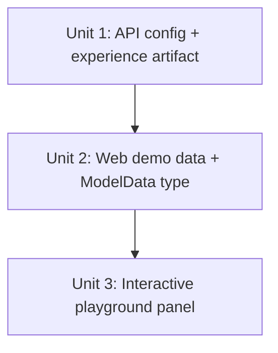

# feat: Run Preview scripted playground for published models

## Overview

Replace the dead "Run preview" button on the published model detail page with an interactive, HuggingFace-Spaces-style playground driven by a small set of pre-canned synthetic claim scenarios. Each click maps deterministically `scenarioId → output`, simulates a realistic latency, renders prediction + rationale + reason code + confidence, and fires-and-forgets an auditable `preview` session record. No new inference infrastructure is introduced.

## Problem Frame

After publishing a model from the IMDE governed sandbox, the published model detail page advertises a "Run preview" button that does nothing (see [apps/web/app/models/[id]/page.tsx](apps/web/app/models/[id]/page.tsx#L190-L213)). The current static card shows a single hardcoded `sampleInput`/`sampleOutput` pair from [apps/web/lib/models-data.ts](apps/web/lib/models-data.ts#L78-L83). The platform already declares the intended preview type — `previewType: "classification-playground"` at [apps/api/src/lib/sandbox/demo-scenario.ts:407](apps/api/src/lib/sandbox/demo-scenario.ts#L407) — and ships an unused `preview` session type in [apps/api/src/functions/sessions/sessions.ts](apps/api/src/functions/sessions/sessions.ts#L24). The work here closes the gap between affordance and behavior. See origin: [docs/brainstorms/2026-05-22-run-preview-scripted-playground-requirements.md](docs/brainstorms/2026-05-22-run-preview-scripted-playground-requirements.md).

## Requirements Trace

- R1. Interactive playground panel replaces the static preview card (selector + Run + result area).
- R2. "Synthetic data only" badge inside the panel.
- R3. Transient loading state with simulated 400–900 ms latency; Run disabled while in flight.
- R4. Result shows prediction, one-sentence rationale, optional reason code, confidence (0–100 %), simulated latency in ms.
- R5. Switching scenarios and re-running updates the result area without a full page reload.
- R6. Canned scenarios are declared on `scenario.publishedExperience` and carried onto the experience document via `buildImdeDemoPublishArtifacts`.
- R7. Deterministic `scenarioId → output` mapping; outputs stable across runs.
- R8. Each click emits a fire-and-forget `POST /api/sessions` with `sessionType: "preview"`, `assetId`, `input.scenarioId`, output payload, and `metrics.latencyMs`.
- R9. Gate on `experienceType === "published-model-experience"` AND `previewType === "classification-playground"`; other model types untouched.
- R10. Plain-text inputs with short human labels; no JSON editor, no structured form.

## Scope Boundaries

- No real AML inference. The button never calls a scoring endpoint.
- No free-text input. User picks from a fixed list (3 scenarios in this iteration).
- No public/shareable Space URL.
- No "previous runs" history UI on the page (session records still write for audit).
- Other `previewType` values (regression, generation, embedding) are out of scope until a second `previewType` exists.

## Context & Research

### Relevant Code and Patterns

- [apps/web/app/models/[id]/page.tsx](apps/web/app/models/%5Bid%5D/page.tsx#L46-L75) — `"use client"` model detail page. Sources `model` from `models.find(...)` first, falling back to a `useEffect`-driven fetch against `/api/models?demoScenarioId=imde-rcm-denial-demo&tenantId=default` that sets `publishedDemoModel`. In practice no API handler is registered at `/api/models` (the API exposes `/api/model-experiences` — see [apps/api/src/functions/sandbox/sandboxes.ts:779-825](apps/api/src/functions/sandbox/sandboxes.ts#L779-L825) — but the web app does not call it). The page therefore renders from the local constant when present and 404s otherwise.
- [apps/web/lib/models-data.ts](apps/web/lib/models-data.ts#L7-L46) — `ModelData` interface with the current `preview: { title, description, sampleInput, sampleOutput }` shape. `demoPublishedModelExperience` constant exported here is the de-facto source of truth that the page renders.
- [apps/api/src/lib/sandbox/demo-scenario.ts](apps/api/src/lib/sandbox/demo-scenario.ts) — single canonical demo config. `scenario.publishedExperience` and `buildImdeDemoPublishArtifacts` are the API-side source for the published experience document.
- [apps/api/src/functions/sessions/sessions.ts](apps/api/src/functions/sessions/sessions.ts#L14-L40) — `CreateSessionSchema` already accepts `sessionType: "preview"`; `assetId`, `input`, and `metrics.latencyMs` (in the update schema) are first-class.
- [apps/api/test/sandbox-demo.test.js](apps/api/test/sandbox-demo.test.js#L17-L22) — existing Node-based test pattern. Imports compiled artifacts from `../dist/src/lib/sandbox/demo-scenario.js`. New API-side tests follow the same shape.
- Existing button styling and Lucide icons in [apps/web/app/models/[id]/page.tsx](apps/web/app/models/%5Bid%5D/page.tsx#L190-L213) — emerald accent, `Zap` icon, `rounded-xl border border-emerald-500/30 bg-emerald-500/5 p-6` panel. Reuse this visual language.

### Institutional Learnings

- Local-dev API calls on Windows must use `127.0.0.1` (per `apps/web/next.config.ts` rewrite — verified during prior IMDE work). The fire-and-forget `POST /api/sessions` will flow through the existing `/api/:path*` rewrite without changes.
- `apps/web/lib/models-data.ts` is the effective rendering source for the demo published model page today; updates to API-side experience configs do not automatically appear on the page (no API call resolves on the model detail route).

### External References

None gathered. Strong local patterns exist for both the API config shape and the page layout; no new technology layer is introduced.

## Key Technical Decisions

- **Scripted scorer over real inference** — Deterministic `scenarioId → output` map is honest to the demo's synthetic framing, requires no AML endpoint, and is straightforward to swap for a real `POST /api/inference/{modelId}` call later. (Carried from origin doc.)
- **Define scenarios in both the API config and the web constant** — Brainstorm R6 names the API config as canonical, but the model detail page renders from `demoPublishedModelExperience` in `apps/web/lib/models-data.ts` (the `/api/models` fetch has no handler). Updating both keeps the rendering working today and preserves the architectural intent so a later unification of the data path is a pure-deletion change.
- **Inline component, not a separate file** — Lightweight scope; ~80 lines of TSX added to the existing client page. Extracting to a standalone component is a refactor that does not earn its keep yet.
- **Simulated latency: per-click random jitter in 400–900 ms** — Resolves the deferred question from the origin doc. Fixed-per-scenario would be slightly more deterministic for screenshots but less believable across repeated clicks during a live demo.
- **Fire-and-forget `/api/sessions` POST before showing result** — Resolves the deferred timing question. The session POST happens at click time; the UI does not wait on it. Network failures do not block the demo.
- **Replace the existing static card in place** — Resolves the deferred placement question. The card already lives in the right position (above the tabs, under the metrics) and matches the page's visual rhythm.

## Open Questions

### Resolved During Planning

- _Where does the playground panel render?_ → Replace the existing card in place (no layout shift).
- _Scenario data shape?_ → Inline array on the published experience: `{ id, label, inputText, output: { prediction, rationale, reasonCode?, confidence } }`. Small (≤4 entries) and per-experience; no separate resource needed.
- _Latency jitter?_ → Per-click random uniform in [400 ms, 900 ms].
- _Session POST timing?_ → Fire-and-forget before showing the result; UI does not await it.
- _Does the page read from API or constant?_ → Effectively from the local constant today, because no `/api/models` handler is registered on the API. The plan updates the constant alongside the API config so the page renders correctly without depending on an API-side fix.

### Deferred to Implementation

- Whether the existing `useEffect` fetch in [apps/web/app/models/[id]/page.tsx](apps/web/app/models/%5Bid%5D/page.tsx#L54-L73) should be deleted or repointed to `/api/model-experiences?demoScenarioId=imde-rcm-denial-demo&tenantId=default`. Not in this plan's scope — flag as a follow-up only if it surfaces during smoke testing.
- Exact copy for the three scenarios' rationale strings. Best authored while the component is being built and reviewed visually.

## High-Level Technical Design

> *This illustrates the intended approach and is directional guidance for review, not implementation specification. The implementing agent should treat it as context, not code to reproduce.*

Data shape carried from the API config through to the rendered panel:

```text
PublishedExperience (apps/api/src/lib/sandbox/demo-scenario.ts)
  playgroundScenarios: [
    { id: "outpatient-mri-no-auth",
      label: "Outpatient MRI, missing prior auth",
      inputText: "Synthetic claim: outpatient MRI, payer A, no prior auth on file.",
      output: { prediction: "High",
                rationale: "Authorization documentation gap.",
                reasonCode: "CO-197",
                confidence: 0.92 } },
    { id: "inpatient-stay-complete-docs",  ... },
    { id: "ed-visit-coding-mismatch",       ... },
  ]
        │
        ▼  buildImdeDemoPublishArtifacts (carry onto experience doc)
        ▼  mirror in apps/web/lib/models-data.ts
        ▼  consume in apps/web/app/models/[id]/page.tsx

Playground panel UI
  ┌──────────────────────────────────────────────────────┐
  │ Runnable denial risk preview     [Synthetic data]    │
  │ Description...                                       │
  │                                                      │
  │ Pick a synthetic claim:                              │
  │ ◉ Outpatient MRI, missing prior auth                 │
  │ ○ Inpatient stay, complete docs                      │
  │ ○ ED visit, coding mismatch                          │
  │                                                      │
  │ Synthetic input:                                     │
  │ "Synthetic claim: outpatient MRI, payer A, no..."    │
  │                                                      │
  │           [⚡ Run preview]   ← disabled while running │
  │                                                      │
  │ ── Preview output ──                  642 ms         │
  │ Denial risk: High           confidence 92%           │
  │ Authorization documentation gap.       CO-197        │
  └──────────────────────────────────────────────────────┘
```

Click flow: `onClick → setRunning(true) → fire-and-forget POST /api/sessions → setTimeout(jitter) → setResult(scenario.output, latencyMs) → setRunning(false)`. Deterministic and synchronous-feeling.

## Implementation Units



- [x] **Unit 1: Add playground scenarios to demo scenario config and experience artifact**

**Goal:** Declare the canonical playground scenario list on the API-side demo config and carry it through `buildImdeDemoPublishArtifacts` onto the published experience document.

**Requirements:** R6, R7, R10

**Dependencies:** None.

**Files:**
- Modify: `apps/api/src/lib/sandbox/demo-scenario.ts`
- Modify: `apps/api/test/sandbox-demo.test.js`

**Approach:**
- Extend the `scenario.publishedExperience` object with a `playgroundScenarios` array of 3 entries shaped as `{ id, label, inputText, output: { prediction, rationale, reasonCode?, confidence } }`. `prediction` is one of `"High" | "Medium" | "Low"`; `confidence` is a 0..1 float; `reasonCode` is optional.
- Pick scenarios that span the prediction range so the demo demonstrates differentiation: one High (outpatient MRI, missing prior auth), one Medium (ED visit, coding mismatch), one Low (inpatient stay, complete documentation).
- In `buildImdeDemoPublishArtifacts`, surface `playgroundScenarios` on the returned `experience` object alongside the existing `previewType` and `task` fields.
- Mark inputs and outputs as synthetic in the rationale strings so reviewers cannot mistake them for real PHI.

**Patterns to follow:**
- Existing `scenario.publishedExperience` and `buildImdeDemoPublishArtifacts` structure in [apps/api/src/lib/sandbox/demo-scenario.ts](apps/api/src/lib/sandbox/demo-scenario.ts#L390-L420).
- Existing inline test fixtures and `buildImdeDemoPublishArtifacts` calls in [apps/api/test/sandbox-demo.test.js](apps/api/test/sandbox-demo.test.js#L187-L230).

**Test scenarios:**
- Happy path: calling `buildImdeDemoPublishArtifacts` on a valid ready sandbox returns an `experience` object whose `playgroundScenarios` is a 3-element array with stable ids matching the config.
- Happy path: each scenario entry exposes `id`, `label`, `inputText`, and an `output` with at least `prediction`, `rationale`, and `confidence`.
- Edge case: scenario ids are unique within the array (assert via `Set` size).
- Edge case: every `confidence` value lies in `[0, 1]` and every `prediction` is one of `"High" | "Medium" | "Low"`.

**Verification:**
- `npm run build && node --test apps/api/test/sandbox-demo.test.js` (or the package's existing test command) passes with the new assertions.
- Calling `buildImdeDemoPublishArtifacts` returns scenarios with the expected shape and count.

- [x] **Unit 2: Mirror playground scenarios in the web demo data and `ModelData` type**

**Goal:** Update the `ModelData` `preview` field shape and `demoPublishedModelExperience` in the web demo data so the model detail page can render the playground from a single client-visible source.

**Requirements:** R6, R10

**Dependencies:** Unit 1 (so the data shape matches the API-side authoritative definition).

**Files:**
- Modify: `apps/web/lib/models-data.ts`

**Approach:**
- Extend the `ModelData.preview` type to add an optional `scenarios?: Array<{ id: string; label: string; inputText: string; output: { prediction: "High" | "Medium" | "Low"; rationale: string; reasonCode?: string; confidence: number } }>` field. Keep the existing `sampleInput` / `sampleOutput` fields for backward compatibility — they are unused by the new panel but referenced by [apps/web/app/models/page.tsx](apps/web/app/models/page.tsx#L50-L60) in the model card.
- Populate `demoPublishedModelExperience.preview.scenarios` with the same three entries declared in Unit 1's API config. Keep the strings byte-identical so a future unification of the data path (read scenarios from the API experience document) is a clean swap.

**Patterns to follow:**
- Existing `ModelData` interface and `demoPublishedModelExperience` constant in [apps/web/lib/models-data.ts](apps/web/lib/models-data.ts#L7-L98).

**Test scenarios:**
- Test expectation: none — pure data declaration with no behavior. Type correctness verified via `tsc --noEmit` (Unit 3 covers behavioral verification).

**Verification:**
- `cd apps/web && npm run type-check` passes.
- Manual: navigate to `/models/rcm-denial-prediction-space` and confirm the existing static card still renders unchanged (until Unit 3 replaces it).

- [x] **Unit 3: Build the interactive playground panel**

**Goal:** Replace the static preview card in the published model detail page with an interactive scenario selector + Run button + result area that drives the deterministic scorer, simulates latency, and emits a `preview` session for audit.

**Requirements:** R1, R2, R3, R4, R5, R8, R9

**Dependencies:** Unit 2.

**Files:**
- Modify: `apps/web/app/models/[id]/page.tsx`

**Approach:**
- Add a `useState` for `selectedScenarioId` (defaulting to `scenarios[0].id`), `running` (boolean), and `result` (`{ scenarioId, output, latencyMs } | null`).
- Render the panel only when `model.experienceType === "published-model-experience"` AND `model.preview?.scenarios?.length > 0` — falling back to the existing static `sampleInput`/`sampleOutput` card when scenarios are absent, so other published experiences without a scenario list keep their current behavior. This double-gate satisfies R9 without needing a `previewType` field on the web type (`previewType` is server-side only and the absence of `scenarios` is a sufficient client-side guard).
- On Run click:
  1. Set `running = true`, `result = null`.
  2. Pick a random latency in `[400, 900]` ms (`Math.floor(400 + Math.random() * 501)`).
  3. Fire-and-forget `fetch("/api/sessions", { method: "POST", headers: { "Content-Type": "application/json" }, body: JSON.stringify({ assetId: model.id, sessionType: "preview", input: { scenarioId: selected.id, inputText: selected.inputText }, config: { previewType: "classification-playground" } }) })` — do not `await`; swallow errors (`.catch(() => {})`).
  4. `setTimeout` for the chosen latency; inside, set `result = { scenarioId: selected.id, output: selected.output, latencyMs }` and `running = false`.
- UI structure:
  - Header row: title + description on the left, "Synthetic data only" badge on the right (Lucide `ShieldAlert` or `FlaskConical` icon + emerald/amber pill).
  - Scenario selector: vertical radio-style list of `scenarios` showing each `label`. Use `<button>` elements with `aria-pressed` and the project's existing `cn(...)` utility for selected/unselected styling.
  - Selected scenario's `inputText` shown in the "Synthetic input" card (matches today's layout).
  - Run button: existing emerald `<Button>` with `Zap` icon; disabled while `running`; show a spinner (`Loader2` from lucide-react with `animate-spin`) when running.
  - Result area: replaces "Preview output" card content when `result` is set. Shows `prediction` (with conditional color: red/amber/emerald for High/Medium/Low), `confidence` as a percentage, `latencyMs`, `rationale` (one sentence), and `reasonCode` (small monospace pill) when present. When `result` is null, show a muted "Pick a scenario and run preview" placeholder.
- Keep the gating `model.experienceType === "published-model-experience" && model.preview` block; the inner content shifts from static to interactive based on whether `model.preview.scenarios` is present.
- Do not import any new top-level dependencies; reuse `Button`, `cn`, and existing `lucide-react` icons already imported in the file.

**Execution note:** None — pure additive UI work in a `"use client"` page with no existing automated tests for this component.

**Patterns to follow:**
- Existing emerald-accent preview card markup at [apps/web/app/models/[id]/page.tsx](apps/web/app/models/%5Bid%5D/page.tsx#L190-L213).
- `useState` + `useEffect` patterns already in the same file (the `publishedDemoModel` fetch flow).
- The `Button` + `Zap` icon styling currently used for the static "Run preview" button.
- Existing imports for `cn`, `Button`, and `lucide-react` icons at the top of the file.

**Test scenarios:**
- Manual smoke: navigate to `/models/rcm-denial-prediction-space` with the local API running; verify the new panel renders with three radio scenarios and a "Synthetic data only" badge.
- Manual smoke: click each scenario radio in turn, then Run — confirm the result area updates with the matching prediction/rationale/reasonCode/confidence, a latency in the 400–900 ms range, and that the Run button is briefly disabled with a spinner.
- Manual smoke: with the API down, click Run — confirm the result still renders correctly (fire-and-forget swallows the error).
- Manual smoke: open the Network tab; confirm a `POST /api/sessions` request is sent on each click with `sessionType: "preview"` and the expected `assetId` + `input.scenarioId`.
- Manual smoke: navigate to a non-published-experience model (e.g., `/models/model-1`) — confirm the panel does not render (the existing UI is unchanged).
- Manual smoke: verify the panel falls back to the static `sampleInput`/`sampleOutput` view if `scenarios` is absent (temporary edit the constant to remove `scenarios` to test, then revert).
- Type-check: `cd apps/web && npm run type-check` passes.

**Verification:**
- The "Run preview" button is wired and produces a deterministic, branded result within ~1 second on click.
- No new TypeScript errors in the web project.
- A `preview` session document appears in the `sessions` Cosmos container for each click (visible via the existing audit tooling or by querying the container directly).
- The non-published-model paths through `/models/[id]` are visually unchanged.

## System-Wide Impact

- **Interaction graph:** Adds a new client → `/api/sessions` POST (write-only, fire-and-forget). No other API surfaces or backend handlers are touched. The existing `publishSandboxModel` handler is unchanged.
- **Error propagation:** Fire-and-forget design means session-write failures never block the UI. The deterministic scorer cannot fail.
- **State lifecycle risks:** None. Sessions inherit the existing 24 h TTL on the container. Each click writes one session document; clicks during a demo are bounded.
- **API surface parity:** `/api/sessions` is unchanged. `/api/model-experiences` gains a new field (`playgroundScenarios`) on the experience document via Unit 1, but no consumer reads it yet — purely additive.
- **Integration coverage:** Unit 1's tests verify the API config carries the scenarios. Unit 3's manual smoke verifies the client → session POST integration. No cross-layer test infra exists for the web app.
- **Unchanged invariants:** The publish flow ([apps/api/src/functions/sandbox/sandboxes.ts publishSandboxModel](apps/api/src/functions/sandbox/sandboxes.ts#L675-L750)) is not modified. Authorization gates from the previous fix remain in place. The model detail page's data-loading path is not refactored; we only add UI within the existing gated block.

## Risks & Dependencies

| Risk | Mitigation |
|------|------------|
| The model detail page's `/api/models` fetch is silently 404'ing and the page relies on the constant. A future fix to that fetch could break parity if the API experience document lacks scenarios. | Unit 1 places scenarios on the API experience document with byte-identical strings to the web constant, so a future unification is a pure swap. |
| Session POSTs could spam the local Cosmos emulator during a long demo. | Sessions container has a 24 h TTL; fire-and-forget bounds blast radius to "extra rows that auto-expire." Documented in Risks rather than mitigated further. |
| Random latency could feel jarring across rapid demo clicks. | Range chosen (400–900 ms) is tight enough to feel snappy. If a presenter wants ultra-deterministic timing for screenshots, the value can be made env-driven in a follow-up; not worth it now. |
| `scenarios.length === 0` after future edits could leave the panel empty. | Component double-gates on `scenarios && scenarios.length > 0`, falling back to the existing static `sampleInput`/`sampleOutput` UI. |

## Documentation / Operational Notes

- No README, runbook, or onboarding doc updates required — this is an extension of an already-shipped IMDE demo path. The brainstorm doc remains the durable spec.
- Demo reset script (`demos/reset-demo.ps1`) does not need changes; the new scenarios travel with the demo scenario config and are seeded by the existing publish flow.

## Sources & References

- **Origin document:** [docs/brainstorms/2026-05-22-run-preview-scripted-playground-requirements.md](docs/brainstorms/2026-05-22-run-preview-scripted-playground-requirements.md)
- Related code: [apps/web/app/models/[id]/page.tsx](apps/web/app/models/%5Bid%5D/page.tsx), [apps/web/lib/models-data.ts](apps/web/lib/models-data.ts), [apps/api/src/lib/sandbox/demo-scenario.ts](apps/api/src/lib/sandbox/demo-scenario.ts), [apps/api/src/functions/sessions/sessions.ts](apps/api/src/functions/sessions/sessions.ts)
- Related tests: [apps/api/test/sandbox-demo.test.js](apps/api/test/sandbox-demo.test.js)
